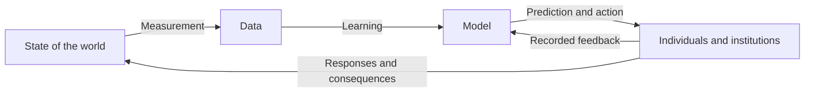

# Lecture 1: Fairness and Machine Learning as a Sociotechnical Loop

## Course notes on Barocas, Hardt, and Narayanan, *Fairness and Machine Learning*, Introduction

**Primary source:** Solon Barocas, Moritz Hardt, and Arvind Narayanan, [“Introduction,” *Fairness and Machine Learning*](https://fairmlbook.org/pdf/introduction.pdf), 26-page PDF.

**Format:** Self-contained course-note chapter. Page references below refer to the printed page numbers in the source PDF.

## Learning objectives

After studying these notes, you should be able to:

1. Explain why evidence-based decision-making can still be inaccurate or unfair.
2. Distinguish a demographic disparity from statistical bias.
3. Trace a machine-learning system through measurement, learning, action, and feedback.
4. Identify how inequity can enter at every stage of that loop.
5. Explain why omitting a protected attribute does not necessarily remove its influence.
6. Distinguish correlation-based prediction from causal reasoning about interventions.
7. Analyze the chapter's hiring example and compare several possible interventions.
8. Distinguish allocative harms from representational harms.
9. Explain why fairness cannot be reduced to a single technical metric.

---

## 1. The central problem: learning from history can reproduce history

High-stakes decisions affect access to education, employment, credit, insurance, bail, and parole. Statistical models are attractive in these settings because they can apply rules consistently and uncover relationships that unaided human judgment may miss.

The attraction is real. The chapter cites a 2002 loan-underwriting study in which an automated system was both more accurate and less racially disparate than the human-centered alternative (pp. 1-2). The authors are therefore not arguing that human judgment is automatically fair or that automation is automatically harmful.

The difficulty is that machine learning learns from examples. It generalizes patterns found in past data to new cases. When historical data reflect prejudice, stereotypes, unequal opportunity, uneven surveillance, or flawed measurement, a model may learn those patterns just as successfully as it learns genuinely useful relationships.

This creates the chapter's central tension:

| Promise of data-driven decisions | Corresponding risk |
|---|---|
| More consistent than individual discretion | Consistently reproduces a bad rule or bad proxy |
| Uses historical evidence | Historical evidence reflects historical inequality |
| Discovers subtle patterns | Cannot decide by itself which patterns are morally acceptable |
| Improves predictive accuracy | Accuracy may conflict with fairness, legitimacy, or dignity |
| Can be audited mathematically | Important data, objectives, and systems may be proprietary |

The key lesson is not that machine learning is necessarily worse than human decision-making. It is that **being evidence-based is not sufficient evidence of being fair**.

### A mental model: the social mirror

Imagine a camera pointed at a tilted table. A precise photograph can faithfully represent the tilt. Precision does not level the table.

Likewise, a well-calibrated model may faithfully encode differences present in society. Fidelity to the data tells us whether the model represents the observed world, not whether the observed world is just.

### Check your understanding

1. Why can a more accurate model still be less acceptable than a less accurate decision process?
2. What additional premise would be needed to conclude that faithfully reproducing historical patterns is fair?

---

## 2. Disparity, discrimination, and statistical bias are different ideas

The chapter opens its fairness discussion with Amazon's same-day delivery service. A 2016 investigation found that, in many U.S. cities, White residents were more than twice as likely as Black residents to live in eligible neighborhoods (p. 3). Race reportedly was not an explicit input; efficiency and cost were the stated design considerations.

The example separates three questions that are often collapsed:

1. **Is there a demographic disparity?** Are outcomes distributed differently across social groups?
2. **Is it justified?** Is there an adequate reason for the difference?
3. **Is it harmful?** Does it withhold opportunity, reinforce subordination, or perpetuate a history of inequality?

A disparity alone does not reveal its cause or moral status. Intent is also not decisive: a designer can lack discriminatory intent while a system still produces harmful group differences.

### 2.1 Demographic disparity

Let $A$ denote group membership and $D$ a favorable decision. A simple way to describe a disparity is to compare selection probabilities:

$$
P(D=1\mid A=a) \quad \text{and} \quad P(D=1\mid A=b).
$$

If these probabilities differ, the groups experience different decision rates. This equation detects a difference; it does not establish why the difference arose or whether it is unjust.

### 2.2 Statistical bias

The word *bias* has a narrower technical meaning in statistics. For an estimator $\hat{\theta}$ of a quantity $\theta$, statistical bias is:

$$
\operatorname{Bias}(\hat{\theta}) = \mathbb{E}[\hat{\theta}] - \theta.
$$

Term by term:

- $\hat{\theta}$ is the estimate produced from a sample.
- $\mathbb{E}[\hat{\theta}]$ is its average value over repeated samples.
- $\theta$ is the true quantity we want to estimate.
- A nonzero difference means the estimator is systematically too high or too low.

**Worked example.** Suppose a delivery-time system predicts arrival 2.5 hours earlier than the true time on average. Its statistical bias is $-2.5$ hours. That statement does not, by itself, say anything about demographic fairness.

| Concept | What it asks | Requires social groups? | Is it automatically morally objectionable? |
|---|---|---:|---:|
| Statistical bias | Is an estimator systematically wrong? | No | No |
| Demographic disparity | Do outcomes differ across groups? | Yes | No |
| Discrimination | Is group-differentiated treatment or impact unjustified or harmful? | Usually | Yes, by definition used here |

The authors use *bias* cautiously because moving between its statistical and social meanings can conceal the reasoning needed to connect a numerical difference to an ethical judgment.

### Check your understanding

1. Could a system be statistically unbiased while producing a large demographic disparity? Explain.
2. Why does the Amazon example require historical and social context rather than only a comparison of delivery rates?

---

## 3. The machine-learning loop

The chapter's organizing device is a closed loop rather than a one-way prediction pipeline.

The four analytical stages are:

1. **Measurement:** translate the world into variables, rows, labels, and categories.
2. **Learning:** fit a model that summarizes patterns in those data.
3. **Action:** use predictions to rank, classify, allocate, or intervene.
4. **Feedback:** observe responses and outcomes, then use them directly or indirectly to update the model or future data.

The word *loop* matters. A hiring model changes who gets hired; hiring changes who gains experience; experience changes later résumés and performance records; those records may train the next model. The system does not merely observe society. It participates in making the society it will later observe.

### Pipeline view versus loop view

| Pipeline view | Loop view |
|---|---|
| Treats data as a fixed input | Asks how prior decisions produced the data |
| Evaluates a prediction at one moment | Evaluates effects that accumulate over time |
| Assumes the model observes an external world | Recognizes that model-driven actions change that world |
| Focuses on model error | Also studies institutions, incentives, people, and power |
| Often assumes training and test data are independent and identically distributed | Expects deployment to alter future data distributions |

This broader frame turns an algorithmic system into a **sociotechnical system**: a combination of models, people, institutions, rules, incentives, and histories.

---

## 4. Before measurement: inequality already exists in the world

Training data about people begin from a society with existing demographic differences. The source gives occupational gender imbalance as an example. A hiring model built from past workers inherits a baseline shaped by explicit discrimination, stereotypes, unequal preparation, different opportunities, and workplace conditions (pp. 5-6).

Even apparently non-human applications can contain social selection effects. Boston's Street Bump project used smartphone sensors to locate potholes. Because smartphone ownership was uneven across neighborhoods, the data collection mechanism could prioritize wealthier areas and underrepresent lower-income or older residents (p. 6).

The chapter's survey of the 30 highest-prize Kaggle competitions makes the scope concrete:

| Competition relationship to people | Count out of 30 |
|---|---:|
| Directly made decisions about individuals | 14 |
| Did not decide about people, but outputs directly affected people | 5 |
| No obvious direct impact identified | 9 |
| Insufficient information to classify | 2 |

These counts show why “this task is not about people” is often too quick. Data may be collected by people, predictions may change markets or public services, and model-driven knowledge may motivate actions that affect communities.

### Worked example: automated essay scoring

1. Human graders assign scores to essays.
2. A model learns to reproduce those scores.
3. Linguistic choices can correlate with social-group membership.
4. If human grading reflects prejudice, the label contains that pattern.
5. High agreement with the graders may therefore mean successful reproduction of the graders' bias.

The model's technical success depends on what the target label means. Agreement with a flawed label is not agreement with an ideal of merit.

### Check your understanding

1. Why might a pothole-detection app produce unequal public-service coverage without ever using race or income?
2. In automated essay scoring, what is the difference between predicting the observed score and measuring writing quality?

---

## 5. Measurement is a design process, not a neutral recording process

Measurement converts a complex world into machine-readable categories. Every conversion requires choices about what exists, what matters, what can be observed, and which proxy will stand for an unobservable construct.

### 5.1 Constructs, measurements, and proxies

A **construct** is an abstract idea of interest, such as creditworthiness, job quality, academic promise, or likelihood of committing a crime.

A **measurement** is an operational variable used to represent that construct, such as a credit score, manager rating, GPA, or arrest record.

A **proxy** is a measured quantity used in place of something we cannot observe directly.

The mapping is:

$$
\text{construct of interest} \longrightarrow \text{operational definition} \longrightarrow \text{recorded value}.
$$

Each arrow can introduce distortion.

| Intended construct | Possible measurement | Why the measurement can mislead |
|---|---|---|
| Job performance | Manager review | May reflect evaluator prejudice or unequal workplace support |
| Sales ability | Number of sales | May reflect customer prejudice or territory quality |
| Criminal behavior | Arrest | Measures policing and detection as well as behavior |
| Academic potential | GPA | Reflects prior educational opportunity and institutional variation |
| Creditworthiness | Repayment history or score | The construct is partly created for a particular lending purpose |

### 5.2 Target variables deserve special scrutiny

In supervised learning, the target variable $Y$ is what the model is trained to predict. If the desired construct is $Y^*$ but the dataset records a proxy $Y$, then the model learns:

$$
\hat{Y} = f(X) \approx Y,
$$

not necessarily

$$
\hat{Y} \approx Y^*.
$$

**Worked example: arrests as a proxy for crime.** Suppose actual offending is the desired construct, but arrests are the available label. Arrests depend on offending, where police patrol, which behaviors are prioritized, whom officers stop, and whether conduct is detected. A model that accurately predicts arrests may primarily learn patterns of enforcement. Improving its arrest-prediction accuracy does not repair the construct mismatch.

### 5.3 Categories can change what they describe

The chapter discusses an analysis of racial representation at U.S. colleges from 1980 to 2015. A “multiracial” category was added only in 2008. Comparing racial percentages across the full period therefore mixes a social change with a change in the measurement instrument (pp. 7-8).

This is more than missing-data cleanup. Race is not a fixed physical reading like temperature. Categories, self-identification, and social meaning change over time. The instrument can alter the phenomenon it claims merely to record.

### 5.4 Technology embeds measurement choices

Cameras illustrate why even physical recording is designed. Historically, film chemistry, color balance, default settings, and limited dynamic range were optimized in ways that represented lighter skin better than darker skin (pp. 8-9). A photograph is thus not an unmediated copy of visual reality.

The lesson generalizes: **data provenance is part of model analysis**. Ask who defined the variables, who was included, how observations were collected, what technology transformed them, and what was lost.

### Measurement audit questions

- What real-world construct do we care about?
- Is the construct coherent and normatively defensible?
- What recorded variable stands for it?
- Who defined the categories?
- Who or what is systematically missing?
- Does collection quality differ across groups?
- Did the categories or collection process change over time?
- What institution produced the records, and for what original purpose?

### Check your understanding

1. Why is replacing performance reviews with sales totals not necessarily an objective solution?
2. If a model predicts arrests with perfect accuracy, what can and cannot be concluded about its prediction of criminal behavior?

---

## 6. Learning: models cannot separate knowledge from stereotypes on their own

Once data are collected, a learning algorithm finds patterns useful for predicting the target. Some patterns encode knowledge we want, such as an association between smoking and cancer. Others encode stereotypes or injustice we may reject. The algorithm does not receive a built-in moral distinction between the two.

### 6.1 Calibration can preserve disparity

Informally, a calibrated score means that among cases assigned a probability $p$, the event occurs about a fraction $p$ of the time. If $S$ is a risk score and $Y$ an outcome, a group-conditional form is:

$$
P(Y=1\mid S=p, A=a) = p.
$$

Term by term:

- $Y=1$ is the event of interest.
- $S=p$ selects people receiving score $p$.
- $A=a$ selects a social group.
- Equality says the score matches the observed event frequency for that group.

Calibration is useful, but it does not tell us whether $Y$ is a valid target, whether group base rates arose justly, or whether acting on the score is legitimate. Faithfully reflecting observed data can faithfully reflect observed disparity.

### 6.2 Removing a protected attribute is not enough

Suppose gender $A$ is removed from a résumé dataset, leaving features $X$. If some feature—such as age at which a person began programming—is correlated with gender, then $X$ still carries information about $A$.

The issue can be expressed as:

$$
P(A\mid X) \neq P(A).
$$

Knowing $X$ changes what can be inferred about group membership. Such a feature acts as a **proxy** or **redundant encoding**.

The difficult part is that a proxy may also be relevant. Programming experience may help predict job performance and also reflect unequal access to early computing opportunities. Dropping every correlated feature can destroy useful information without addressing the underlying cause.

### 6.3 Sample-size disparity

If a group has fewer training examples, a model has less information with which to learn group-relevant patterns. Overall accuracy can hide this failure.

**Worked example.** Consider 1,000 test cases:

- Group A: 900 cases, 4% error → 36 errors.
- Group B: 100 cases, 20% error → 20 errors.
- Overall error: $(36+20)/1000 = 5.6\%$.

Reporting only 5.6% makes the system look broadly reliable. Reporting by group reveals that Group B's error rate is five times Group A's.

Anomaly detection is especially vulnerable because “unusual” is often defined relative to majority behavior. A name, transaction pattern, or communication style that is rare in the pooled data may be ordinary within a particular culture.

### 6.4 Language example

The chapter illustrates English-to-Turkish-to-English translation. Turkish pronouns can be gender-neutral; translating back to English requires the system to choose a gendered pronoun. Historical occupation patterns and a male-as-default convention then influence the output, producing stereotyped doctor/nurse gender assignments (pp. 10-11).

The model is not inventing a value system from nowhere. It is compressing regularities in its corpus. The normative question is whether reproducing those regularities is an acceptable system objective.

### Check your understanding

1. Why can calibration be technically desirable and ethically insufficient at the same time?
2. In the error-rate example, what decision would you make differently after seeing group-specific performance?

---

## 7. Action: prediction is not intervention

A model finds statistical relationships. Deployment uses those relationships to change the world. This transition requires causal reasoning.

### 7.1 Correlation is not a treatment rule

The chapter's medical example concerns a model that associated asthma with lower pneumonia risk. A plausible explanation was that asthma patients were more likely to receive intensive inpatient care (p. 12).

Represent the relationship as:

$$
\text{Asthma} \rightarrow \text{More intensive care} \rightarrow \text{Lower observed complications}.
$$

A prediction model can learn that asthma is associated with a better recorded outcome. But a decision rule “admit lower-risk patients and discharge higher-risk patients” could remove the care that created the apparently protective association.

The essential distinction is:

| Predictive question | Causal question |
|---|---|
| Among historically observed patients, who had complications? | What would happen if we changed this patient's treatment? |
| Estimates $P(Y\mid X)$ | Seeks the effect of an intervention on $Y$ |
| Can exploit any stable association | Must account for why the association exists |

### 7.2 Base rates, calibration, and error disparities

The chapter previews a formal limitation studied later in the book: when groups have different base rates, a calibrated score will generally produce different false-positive or false-negative rates across groups under a common decision rule (pp. 11-12).

The intuition is simple. If the underlying outcome is less common in one group, then even a similarly meaningful risk score is applied to a different mixture of positive and negative cases. A fixed threshold partitions those mixtures differently.

This does not itself tell us which metric to prioritize. It tells us that desirable statistical properties can conflict, so choosing among them is partly a policy and moral decision.

### 7.3 Drift and process legitimacy

Populations and institutions change. If subpopulations change at different rates while the model stays fixed, performance disparities can emerge or grow. This is **drift**.

Outcomes are not the only consideration. People may also care whether a decision can be explained, contested, corrected, and governed. A model can achieve a favorable aggregate metric while failing these procedural requirements.

### Check your understanding

1. Why would using the asthma association as an admission rule reverse the meaning of the evidence?
2. What information beyond a risk score is needed to choose an ethically defensible action?

---

## 8. Feedback: predictions can produce the evidence that validates them

Feedback occurs when system outputs affect behavior or data later treated as evidence. The chapter identifies several forms.

### 8.1 Position-biased feedback

A search engine places one result first. Users click it partly because it is first. The system interprets clicks as evidence of relevance and promotes it again.

The observation is confounded:

$$
\text{click} = f(\text{relevance}, \text{position}, \text{presentation}, \text{user context}, \ldots).
$$

Treating the click as a pure measure of relevance overstates what it tells us.

### 8.2 Self-fulfilling predictions

In predictive policing:

1. Historical records indicate more arrests in an area.
2. The system predicts more crime there.
3. More officers are sent there, or their threshold for intervention falls.
4. More offenses are observed and more arrests are made.
5. Those arrests become new training data.
6. The next model again predicts more crime there.

A compact pedagogical recurrence is:

$$
D_{t+1} = g(W_t, A_t), \qquad A_t = h(M_t), \qquad M_t = \operatorname{Learn}(D_t),
$$

where:

- $D_t$ is recorded data at time $t$,
- $M_t$ is the fitted model,
- $A_t$ is the action chosen from the model,
- $W_t$ is the underlying world,
- and the next dataset depends on both the world and the action.

The critical point is that $D_{t+1}$ is not an independent sample from an untouched world.

### 8.3 Quantitative example from the chapter

Lum and Isaac's simulation of PredPol using Oakland police records found that Black people would be targeted for predictive policing of drug crimes at roughly twice the rate of White people, despite the two groups having roughly equal drug-use rates (p. 14). The simulation showed the initial difference becoming amplified as policing concentrated on already targeted areas.

### 8.4 Decisions can change labels

Pretrial detention can affect case outcomes. The chapter describes research exploiting quasi-random assignment to judges with different strictness levels; this work found that detention itself increased the likelihood of conviction (pp. 13-14).

If a risk model is evaluated using conviction as the outcome, but the model's recommendation influences detention and detention influences conviction, the label is partly caused by the decision process being evaluated.

### Three levels of feedback

| Level | What changes | Example |
|---|---|---|
| Observed response | A measured signal | Search-result position changes clicks |
| Future training set | Which cases and labels enter the data | Police deployment changes recorded arrests |
| Social phenomenon | People's opportunities and institutions | Repeated surveillance contributes to durable inequality |

### Check your understanding

1. In predictive policing, which variable is closer to “crime”: reported offenses, police observations, or arrests? What does each miss?
2. Why does correcting position bias in clicks solve only part of the search-engine feedback problem?

---

## 9. Worked example: a hiring classifier

The chapter's toy example makes the earlier issues concrete (pp. 15-18).

### 9.1 Setup

Each applicant has two observed features:

- $x_1$: college GPA,
- $x_2$: interview score.

Historical employees also have a performance rating $Y$. A simple linear model predicts performance:

$$
\hat{Y} = \beta_0 + \beta_1 x_1 + \beta_2 x_2.
$$

Term by term:

- $\beta_0$ is the baseline prediction.
- $\beta_1$ is how much predicted performance changes with GPA, holding interview score fixed.
- $\beta_2$ is how much it changes with interview score, holding GPA fixed.
- $\hat{Y}$ is the predicted performance rating.

The employer selects applicants above a cutoff $c$:

$$
D = \mathbf{1}[\hat{Y} \ge c].
$$

Here $\mathbf{1}[\cdot]$ equals 1 when the condition is true and 0 otherwise. Geometrically, the cutoff creates a line in the GPA/interview plane. Applicants on one side are selected.

### 9.2 Why blindness does not ensure parity

The model does not use demographic group $A$ directly. Nevertheless, the source figure shows one group being selected more often.

The path can be:

$$
A \longrightarrow \text{unequal education or workplace conditions} \longrightarrow (X,Y) \longrightarrow \hat{Y} \longrightarrow D.
$$

Alternatively, manager prejudice may directly affect the historical performance label $Y$. Several causal stories fit the same observed pattern. The data alone do not identify which story is correct.

### 9.3 Candidate interventions

| Intervention | Potential benefit | Main limitation |
|---|---|---|
| Remove group membership | Prevents explicit direct use | Proxies can preserve group information |
| Remove GPA because it is a proxy | May reduce one path for disparity | Can sacrifice relevant predictive information; other proxies remain |
| Use group-specific cutoffs | Can equalize or narrow selection-rate differences | Requires a normative target; may feel crude; legality depends on context |
| Optimize cohort diversity | Can improve diversity without directly using group membership | Requires a defensible similarity/distance function; can reward irrelevant difference |
| Change workplace conditions | Addresses a cause of unequal performance | Goes beyond model design and may require institutional reform |
| Do not deploy the system | Avoids legitimizing an unjust process | Gives up possible consistency or accuracy benefits; an alternative process is still needed |

### 9.4 Selection-rate comparison and the 80% guideline

If two groups have selection rates $s_a$ and $s_b$, a common comparison is:

$$
r = \frac{\min(s_a,s_b)}{\max(s_a,s_b)}.
$$

**Worked example.** If Group A has a 50% selection rate and Group B has a 35% rate, then:

$$
r = \frac{0.35}{0.50} = 0.70.
$$

The lower rate is 70% of the higher rate, a 30% relative shortfall. The chapter notes that U.S. Equal Employment Opportunity Commission guidance has used a difference exceeding 20%—equivalently, a ratio below 0.8—as a possible trigger for disparate-impact scrutiny (p. 16). It is not an automatic finding of illegality; justification and avoidability still matter.

### 9.5 A diversity objective

The chapter suggests a cohort-level objective based on pairwise distance. A pedagogical form is:

$$
\max_{S:|S|=k}
\left[
\sum_{i\in S}\hat{Y}_i
+
\lambda\frac{2}{k(k-1)}\sum_{i<j,\,i,j\in S} d(x_i,x_j)
\right].
$$

Term by term:

- $S$ is the selected cohort of size $k$.
- $\hat{Y}_i$ is candidate $i$'s predicted performance.
- $d(x_i,x_j)$ measures how different candidates $i$ and $j$ are.
- The double sum measures average pairwise diversity.
- $\lambda$ controls the tradeoff between individual predicted performance and cohort diversity.

**Mental picture.** Selecting the top individual scores can produce a team of 11 excellent goalkeepers. A cohort objective recognizes that a team's value can depend on the combination of its members.

The formula does not solve the normative problem. Which features should define distance? Should GPA difference count as diversity? Should disability, experience, discipline, or perspective? Different answers encode different goals. The objective makes the value choice visible; it does not eliminate it.

### Check your understanding

1. Draw two causal stories that could explain lower historical performance ratings for one group. Would the same intervention fit both stories?
2. In the diversity objective, what happens as $\lambda$ moves from 0 to a very large value?
3. Why is equalizing selection rates a policy choice rather than a conclusion forced by the data?

---

## 10. Fair decisions are not enough

The chapter broadens fairness beyond changing the decision rule.

### 10.1 Change the environment, not only the classifier

A hiring model asks who will succeed in the current workplace. That treats the workplace as fixed. But unequal predicted performance may be caused by an inaccessible environment, hostile culture, inflexible scheduling, or uneven training.

The social model of disability makes the alternative vivid. A person's difficulty may result from the interaction between their body and an environment that lacks ramps, assistive equipment, or flexible arrangements. Changing the cutoff does not build the ramp.

This suggests three intervention targets:

| Target | Example intervention | Question it answers |
|---|---|---|
| Decision rule | Adjust thresholds or constraints | How should we allocate under current conditions? |
| Measurement/model | Redefine labels, collect better data, audit group error | How should we represent and predict? |
| Underlying institution | Improve accessibility, training, culture, or opportunity | Why do the predicted differences exist? |

### 10.2 Some systems should not be built

A system can work equally well across groups and still be illegitimate. Perfectly accurate mass facial recognition could threaten freedom of movement and association precisely because it works well. Fairness among subjects is therefore not the same as justification for the system's purpose.

Before asking “Is this model fair?”, ask:

1. Is the underlying objective legitimate?
2. Should this decision be automated?
3. Who has authority to deploy the system?
4. Can affected people contest its outputs?
5. Are there rights that should constrain deployment regardless of accuracy?

---

## 11. Allocative and representational harms

Not every harmful system directly distributes a job, loan, or bail decision.

| Harm type | Mechanism | Examples from the chapter |
|---|---|---|
| **Allocative harm** | Withholds or distributes resources and opportunities | Employment screening, lending, bail, health care |
| **Representational harm** | Reinforces stereotypes, denigrates identities, or shapes cultural visibility | Image search, translation, autocomplete, image labeling |

Allocative harms are often easier to count because a person did or did not receive something. Representational harms can be diffuse and cumulative. Search, recommendation, translation, voice assistants, and image labeling influence how people understand social roles and identities.

The distinction is analytical, not a ranking of importance. A representational pattern can eventually influence allocation, and repeated allocation can reshape representation.

### Worked example: occupation image search

If image results for “CEO” overwhelmingly depict men, the immediate output is representational. Over time, that visibility can reinforce beliefs about who belongs in leadership, affect aspirations and evaluation, and contribute indirectly to allocative outcomes.

---

## 12. What the chapter establishes—and what it does not

This introduction is conceptual and synthetic. Its “results” are not a new benchmark or a single proposed fairness algorithm. It provides an analytical framework supported by examples and prior studies.

### Empirical quantities highlighted in the chapter

| Finding or example | Quantity reported |
|---|---:|
| Same-day delivery eligibility in many U.S. cities | White residents were more than twice as likely as Black residents to live in eligible neighborhoods |
| Top 30 Kaggle competitions | 14 directly decided about people; 5 directly affected people; 9 had no obvious direct impact; 2 were unclear |
| Predictive policing simulation | Black people targeted for drug-crime policing at roughly twice the rate of White people despite roughly equal drug-use rates |
| Employment selection guidance discussed | A greater-than-20% relative difference may trigger scrutiny; it is not a legal bright line |

### Claims the chapter supports

- Disparities can enter before modeling and can be introduced or amplified at every stage.
- Protected-attribute blindness does not remove proxy effects.
- Predictive accuracy does not establish causal validity for interventions.
- Deployment affects future observations, so systems must be studied dynamically.
- Mathematical fairness criteria require normative interpretation.
- Some injustices require institutional change rather than model adjustment.

### Claims the chapter does not support

- Every demographic disparity is discrimination.
- Human decision-makers are always fairer than models.
- A single metric can certify a system as fair.
- Removing sensitive attributes eliminates discrimination.
- Better prediction automatically leads to better decisions.
- Every harmful system can be repaired by “debiasing” the algorithm.

---

## 13. A practical audit using the loop

Use this sequence when evaluating a new system.

### Step 1: State the decision and stakes

- What action will the output cause?
- Who benefits, who bears risk, and how reversible is the decision?

### Step 2: Interrogate the construct

- What do we actually care about?
- Is the target a natural fact, an institutional category, or a policy choice?

### Step 3: Trace measurement

- Which proxy is recorded?
- Who created the labels?
- Which populations or behaviors are under-observed?

### Step 4: Evaluate learning by group and context

- Report subgroup error, not only average error.
- Look for proxies and sample-size disparities.
- Test whether patterns remain stable across settings and time.

### Step 5: Separate prediction from intervention

- What causal story connects the features, decision, and outcome?
- Could the proposed action break the association on which the prediction relies?

### Step 6: Map feedback

- How will the decision change behavior, opportunity, observation, and future training data?
- Which people can adapt, appeal, or withdraw—and who cannot?

### Step 7: Compare intervention levels

- Can the label or data collection be improved?
- Should the decision rule change?
- Should the surrounding institution change?
- Should the system be deployed at all?

### Step 8: Make the normative choice explicit

- Which harms and benefits are being traded off?
- Who gets to decide?
- What legal, ethical, or democratic constraints apply?

---

## 14. Synthesis

The introduction's deepest contribution is a change in the unit of analysis. Fairness is not a property of model weights inspected in isolation. It is a property—or contested aspiration—of a decision process embedded in a changing society.

The full causal picture is:

$$
\text{history and institutions}
\rightarrow
\text{measurement}
\rightarrow
\text{data}
\rightarrow
\text{model}
\rightarrow
\text{action}
\rightarrow
\text{people and institutions}
\rightarrow
\text{future measurement}.
$$

At each arrow, someone chooses what to record, predict, optimize, or do. Technical tools can reveal tradeoffs, test consequences, and sometimes mitigate harm. They cannot decide by themselves which disparities are justified, what counts as harm, whether an institution is legitimate, or what justice requires.

The right response is neither blind optimism nor blanket rejection. It is disciplined analysis of the entire loop, paired with explicit moral and political reasoning.

---

## Glossary

**Allocative harm:** Harm caused by withholding or unevenly distributing an opportunity, resource, or service.

**Base rate:** The prevalence of an outcome in a population or group before conditioning on a model score.

**Calibration:** Agreement between predicted probabilities and observed outcome frequencies.

**Construct:** An abstract concept a system seeks to measure or predict, such as job quality or creditworthiness.

**Demographic disparity:** A difference in outcomes, selection rates, errors, or other quantities across social groups.

**Discrimination:** A harmful or unjustified group-related difference in treatment or effect; determining it requires more than observing a numerical disparity.

**Drift:** Change over time in a population, data-generating process, or relationship between inputs and outcomes.

**Feedback loop:** A process in which a model's outputs affect the future data or world on which later predictions depend.

**Induction:** Forming general rules from specific observed examples.

**Measurement:** The process of translating the world into recorded variables, categories, and labels.

**Proxy:** An observed variable used in place of an unobserved construct, or a variable that indirectly carries information about another attribute.

**Representational harm:** Harm caused by stereotyping, denigration, erasure, or distorted cultural representation.

**Sociotechnical system:** A system whose behavior arises from interaction among technology, people, institutions, incentives, rules, and social conditions.

**Statistical bias:** The difference between an estimator's expected value and the true quantity it estimates.

**Target variable:** The label or outcome a supervised learning system is trained to predict.

---

## Review and exam-style questions

### Short answer

1. Explain the statement “data are a social mirror.” Give one example in which faithful reflection is undesirable.
2. Distinguish statistical bias, demographic disparity, and discrimination.
3. Why is data cleaning unable to solve every measurement problem?
4. Give two reasons why removing gender or race from input features may fail to remove group disparities.
5. Why can overall accuracy conceal a serious fairness problem?
6. Explain how a calibrated model can still be unfair.
7. Give an example in which a prediction changes the outcome it predicts.
8. Why does the hiring toy example require causal reasoning before choosing an intervention?
9. Distinguish allocative and representational harms, then give an example that plausibly involves both.
10. What does it mean to question the legitimacy of a system rather than only its accuracy?

### Analytical problems

1. **Selection-rate analysis.** Group A has 240 applicants and 96 selections. Group B has 160 applicants and 48 selections. Compute each selection rate and the ratio of the lower rate to the higher rate. What does the number establish, and what does it leave unresolved?

2. **Hidden subgroup error.** A classifier is tested on 2,000 cases. It has 3% error on 1,800 cases from Group A and 18% error on 200 cases from Group B. Compute total errors and overall error. Explain why the aggregate result is incomplete.

3. **Measurement map.** For a university admissions model, choose one desired construct and one available proxy. Draw at least three causal paths by which social conditions could affect the proxy.

4. **Feedback analysis.** A platform recommends job advertisements based on prior clicks and trains future models on those clicks. Trace a possible gender feedback loop through all four stages of the machine-learning loop.

5. **Intervention comparison.** In the hiring example, compare group-specific thresholds with workplace reform. State one causal assumption each intervention implicitly makes.

### Discussion prompts

1. When, if ever, should a model deliberately avoid reproducing an accurate historical pattern?
2. Who should have standing to define fairness objectives: system owners, regulators, affected communities, technical experts, or some combination?
3. Can transparency meaningfully help if the underlying target is illegitimate?
4. Is a group-blind model more impartial, or can group blindness itself preserve unequal conditions?
5. What evidence would justify not deploying an automated system at all?

---

## Further reading from the chapter

- Solon Barocas and Andrew D. Selbst, “Big Data's Disparate Impact” (2016): legal and technical analysis of how data mining can produce disparate impact.
- Batya Friedman and Helen Nissenbaum, “Bias in Computer Systems” (1996): an early framework for understanding bias in computing systems.
- Kristian Lum and William Isaac, “To Predict and Serve?” (2016): predictive policing and feedback amplification.
- Danielle Ensign et al., “Runaway Feedback Loops in Predictive Policing” (2017): formal analysis of feedback generated by prediction-guided data collection.
- Rich Caruana et al., “Intelligible Models for Healthcare” (2015): the pneumonia/asthma example and the importance of interpreting predictive patterns.
- Latanya Sweeney, “Discrimination in Online Ad Delivery” (2013): racialized patterns in online advertising.
- Safiya Umoja Noble, *Algorithms of Oppression* (2018): representational harm and search systems.
- Virginia Eubanks, *Automating Inequality* (2018): automated systems and the governance of poverty.

## One-sentence takeaway

**A machine-learning system does not merely learn from society; through measurement, action, and feedback, it also helps create the society from which it will learn next.**
