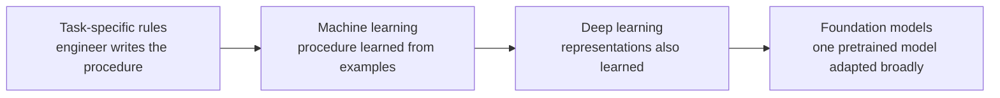
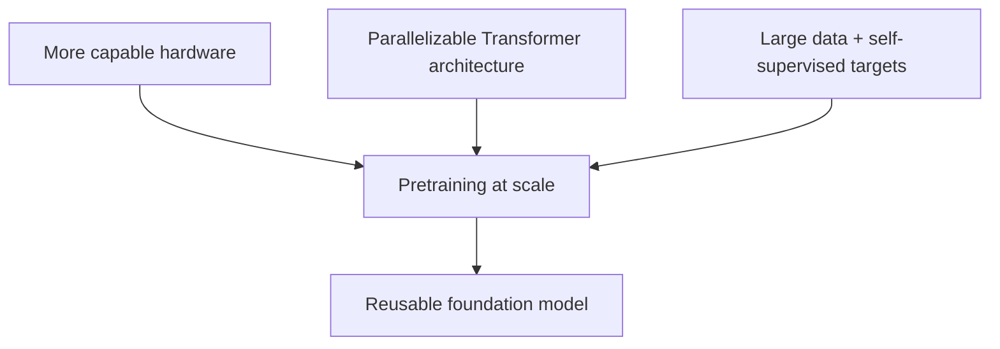
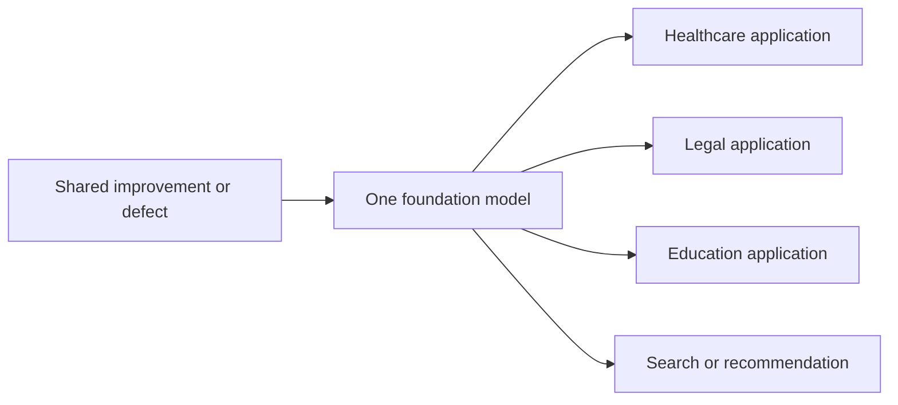
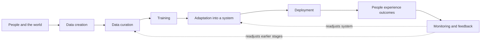

# Lecture 1 Course Notes: Foundation Models as Technical and Social Infrastructure

## Emergence, homogenization, and the foundation-model ecosystem

**Primary reading:** Rishi Bommasani et al., [*On the Opportunities and Risks of Foundation Models*](https://arxiv.org/abs/2108.07258), §§1.1–1.2 (including §1.1.1).

**Scope:** These notes cover only “Emergence and homogenization” and “Social impact and the foundation models ecosystem.” They explain the argument as it appeared in the 2021 report; quantities and examples below should therefore be read in that historical context.

## Learning objectives

After studying this chapter, you should be able to:

1. Define *emergence* and *homogenization* as the report uses those terms.
2. Trace how machine learning, deep learning, and foundation models progressively move more system behavior from explicit engineering into learning.
3. Explain how transfer learning, pretraining, self-supervision, Transformers, hardware, and data combine to make foundation models possible at scale.
4. Explain why homogenization creates both leverage and shared failure modes.
5. Distinguish a foundation model from a task-specific model and explain why the word *foundation* is deliberately incomplete.
6. Separate research on a model from deployment of a system built with that model.
7. Analyze social impact across data creation, data curation, training, adaptation, deployment, and feedback.
8. Apply the report’s principle “think ecosystem, act model” without reducing social evaluation to an automatic score.

---

## 1. The chapter’s two organizing ideas

The report argues that the significance of foundation models is best understood through two simultaneous changes.

**Emergence** means that useful behavior is induced by learning rather than explicitly programmed. The designer specifies a training process, but does not write a separate rule for every behavior the trained system later displays.

**Homogenization** means that many applications increasingly rely on the same methods, architectures, and eventually the same pretrained models. Work that once required a separate technical pipeline for every task can begin from a common base.

These changes create a tension:

| Change | Opportunity | Corresponding risk |
|---|---|---|
| More behavior emerges from training | Capabilities need not be hand-coded one by one | Capabilities and failures can be difficult to predict or understand |
| More tasks share one model | An improvement to the shared model can benefit many applications | A defect in the shared model can propagate to many applications |
| More domains use common tools | Knowledge and engineering effort can transfer across fields | Technical diversity shrinks, creating common dependencies and single points of failure |

### A mental model: a shared foundation under many rooms

Imagine a building in which each room serves a different purpose: a clinic, a classroom, a law office, and a workshop. A stronger common foundation benefits every room. A crack in that foundation may also affect every room, even though the occupants use them differently.

The analogy has a limit that matters. A foundation model is not a finished foundation onto which applications are simply placed. It is an **unfinished computational object** that must be adapted and embedded in a larger system. The choices made during that embedding can amplify, redirect, or mitigate its effects.

### Check your understanding

1. Why does emergence make a capability scientifically interesting and a failure operationally worrying at the same time?
2. Give one example of leverage and one example of systemic risk created by sharing a model across applications.

---

## 2. Three stages in the movement from rules to learned behavior

The report presents the recent history of AI as increasing emergence and increasing homogenization. What changes at each stage is **which layer of the system becomes learned and which layer becomes shared**.

| Era | What the engineer supplies | What learning supplies | What becomes homogenized |
|---|---|---|---|
| Earlier task-specific AI | Rules and procedures for a particular task | Little or none | No broad common component |
| Machine learning | Features, labels, and a generic learning setup | The rule mapping features to predictions | The learning algorithm, such as logistic regression |
| Deep learning | Raw or lightly processed inputs plus an architecture and objective | Both useful representations and the prediction rule | The neural architecture across many tasks |
| Foundation models | Broad data, a scalable pretraining objective, and a large architecture | Reusable representations and sometimes advanced task behavior | The pretrained model itself across many applications |

This table is not claiming that human design disappears. At every stage, people still choose data, objectives, architectures, evaluation criteria, and deployment conditions. “Emergent” means that a particular behavior is induced rather than directly specified, not that the system has no designers or causes.

### 2.1 Machine learning: the procedure emerges

Before machine learning became dominant in AI, developers commonly attempted to specify how a system should solve a task. Machine learning shifted the work: supply historical examples and a learning algorithm, and let the predictive rule be inferred from those examples.

Suppose a spam filter receives features such as the presence of certain words, the number of links, and the sender’s history. An engineer need not write a complete decision tree by hand. A generic algorithm can learn how to weight those features from labeled email.

The emergence occurs at the level of the **task procedure**. The homogenization occurs because the same generic algorithm can be reused for credit prediction, medical classification, spam filtering, and many other tasks.

Complex inputs still presented a bottleneck. For images or sentences, specialists often had to construct features that translated raw pixels or text into a representation a conventional learner could use. Different domains therefore retained different feature-engineering pipelines.

### 2.2 Deep learning: the representation emerges

Deep learning moved another layer into training. A deep neural network can receive raw inputs, such as image pixels, and learn intermediate representations that support prediction. This is called **representation learning**.

For an image classifier, early layers might respond to edges, later layers to textures or shapes, and still later layers to configurations useful for identifying objects. The engineer specifies the architecture and training process, but does not hand-code every useful visual feature.

The emergence now includes the **features themselves**. Homogenization also deepens: related neural architectures can replace many bespoke feature-engineering pipelines. The report points to AlexNet’s ImageNet performance as an emblematic moment in this transition.

### 2.3 Foundation models: reusable models and advanced behavior emerge

Foundation models move the common component from a learning algorithm or architecture to a trained model. A single broadly pretrained model can be adapted to many downstream tasks.

For example, instead of training a separate language model from scratch for sentiment classification, question answering, and summarization, a developer can begin with the same pretrained model and adapt it to each task.

At this stage, emergence can include advanced functions that were not installed as explicit task modules. The report’s central example is GPT-3’s in-context learning: a user can describe or demonstrate a task in a prompt, and the model may perform that task without its parameters being updated for that task.

### Historical progression at a glance

The progression is cumulative. Foundation models still use machine learning and deep neural networks. The report’s claim is not that an entirely unrelated technology appeared, but that scale and reuse produced a new technical and sociological configuration.

### Check your understanding

1. What is the difference between homogenizing a learning algorithm, an architecture, and a trained model?
2. Why does representation learning reduce—but not eliminate—the role of human design?

---

## 3. How a foundation model becomes possible

The report separates two roles:

- **Transfer learning makes broad reuse possible.**
- **Scale makes the reused model powerful.**

### 3.1 Transfer learning, pretraining, and adaptation

Transfer learning means using knowledge learned in one setting to help in another. In the foundation-model pattern, transfer commonly has two phases.

1. **Pretraining:** train a model on a broad surrogate task. The task is valuable partly because solving it forces the model to learn reusable structure.
2. **Adaptation:** specialize the pretrained model for a downstream task, for example through fine-tuning, prompting, or application-specific components.

A compact teaching formalization is:

\[
\text{broad data} \xrightarrow{\text{pretraining}} \text{foundation model}
\xrightarrow{\text{adaptation for task }t} \text{task-specific model or system}.
\]

This is a conceptual pipeline, not an equation proposed by the report. Its key point is that the expensive, general stage can be shared while the final stage varies by application.

### Worked example: from broad language pretraining to sentiment classification

Imagine pretraining a model on a large text collection. The training task makes the model represent syntax, word meaning, and relationships between pieces of text.

To build a movie-review classifier, a developer then supplies a smaller labeled dataset with examples such as “absorbing and beautifully acted” → positive and “confusing and tedious” → negative. Fine-tuning adjusts the pretrained model for that narrower decision.

The downstream system benefits from general language structure learned before it encountered the sentiment labels. It does not have to relearn language from the small application dataset.

### 3.2 Why self-supervision changes the data bottleneck

Traditional supervised learning depends on human-supplied labels. Labels are expensive, so even a large annotated dataset imposes a practical ceiling on pretraining.

**Self-supervised learning** constructs a learning target from the data itself. The report gives two language examples:

| Objective | Input given to the model | Target derived automatically |
|---|---|---|
| Masked language modeling | A sentence with a token hidden | The hidden token from the original sentence |
| Autoregressive language modeling | Earlier tokens in a sequence | The next token in the original sequence |

#### Worked example: masked language modeling

Start with the sentence:

> The student submitted the assignment before midnight.

Hide one token:

> The student submitted the [MASK] before midnight.

The original text already supplies the target, *assignment*. No annotator has to invent a special label. Repeating this operation across large text collections creates many training examples automatically.

The task is useful because predicting missing content requires sensitivity to surrounding context. It is scalable because ordinary text supplies both input and target.

#### Worked example: autoregressive language modeling

Give the model:

> The student submitted the

and train it to predict the next token from the original sequence. The task repeats at successive positions. Again, the text provides its own targets.

The report’s claim is not that either objective perfectly captures language or downstream needs. The claim is that self-supervision makes broad pretraining much more scalable than reliance on manually labeled task data.

### 3.3 The three ingredients of scale

The report identifies three mutually reinforcing ingredients:

1. **Hardware:** improved accelerator throughput and memory made much larger computations feasible. The report states that GPU throughput and memory had increased roughly tenfold over the preceding four years.
2. **Architecture:** the Transformer exploits parallel hardware and supports highly expressive sequence models.
3. **Data:** much larger collections became usable because self-supervised objectives can learn from unannotated data.

None is sufficient alone. More text without an effective objective does not create useful learning. A scalable objective without sufficient computation cannot train a very large model. Hardware without an architecture able to exploit its parallelism leaves capacity unused.

### Check your understanding

1. Why does the report say that transfer learning makes foundation models possible while scale makes them powerful?
2. If a masked-word objective needs no human label for each sentence, where do human choices still enter the training pipeline?

---

## 4. From an NLP technique to shared infrastructure

Self-supervised language learning existed before the foundation-model era. Word embeddings, autoregressive language modeling, GPT, ELMo, and ULMFiT all contributed to the technical trajectory described by the report.

The change around BERT was also sociological. Before 2019, self-supervised language modeling could be viewed as one subarea among many in natural-language processing. After 2019, adapting a pretrained model increasingly became the normal starting point across the field.

That change matters because a technology becomes infrastructure not merely when it works, but when many people reorganize their practices around it.

### 4.1 Three forms of homogenization

| Form | What becomes shared | Example from §1.1 | Why it matters |
|---|---|---|---|
| Within a research field | A small set of pretrained models | NLP systems adapted from BERT, RoBERTa, BART, or T5 | Improvements and defects propagate across many NLP tasks |
| Across research fields | A family of modeling tools | Transformer-style sequence modeling for text, images, speech, tables, proteins, molecules, and reinforcement learning | Previously separate communities begin relying on related technical machinery |
| Across modalities | The actual multimodal model | A model trained jointly on language and vision data | Information from several modalities can be centralized and reused by cross-modal tasks |

Multimodal training pushes homogenization further. Instead of only sharing an architecture, a system can centralize information from text, images, or other modalities in one trained model. Applications that require several kinds of evidence can then adapt the same common model.

### 4.2 Leverage and inherited defects

Let one foundation model support (n) downstream systems. If the base model improves in a genuinely transferable way, that change can benefit many of the (n) systems. This is the report’s idea of **leverage**.

The same fan-out applies to defects. If the base model contains a systematic bias or security weakness that adaptation does not remove, many downstream systems can inherit it.

The diagram does not imply that every downstream system is affected identically. Adaptation, application logic, user population, and deployment context determine whether a property persists and how much it matters. The key structural point is that the shared model creates a common dependency.

### 4.3 Emergence and homogenization amplify each other

The report highlights GPT-3 as an example of scale-associated emergence. GPT-3 had 175 billion parameters, compared with GPT-2’s 1.5 billion, and displayed in-context learning: prompts could induce task performance without ordinary task-specific fine-tuning.

The exact lesson is not “adding parameters always creates a predictable capability.” It is the opposite: important behavior may appear without having been explicitly targeted or anticipated.

Now combine the two organizing ideas:

1. Emergence creates uncertainty about what a model can do and how it will fail.
2. Homogenization encourages many systems to depend on that same model.
3. The uncertain capability or flaw can therefore spread through a large downstream ecosystem.

This is why the report identifies **derisking** as a central challenge. The social value of leverage cannot be separated from the possibility of shared, poorly understood failure.

### Evidence and scale markers in these sections

Sections 1.1–1.2 are a conceptual and historical argument, not a controlled empirical study. Their quantitative markers illustrate scale and reach:

| Quantity reported in 2021 | Role in the argument |
|---|---|
| GPT-3: 175 billion parameters | Example of a very large model associated with in-context learning |
| GPT-2: 1.5 billion parameters | Contrast used to convey the change in scale |
| GPU throughput and memory: about 10× growth over four years | One enabling condition for larger training runs |
| Google Search: 4 billion users, with BERT used as one signal | Example of a foundation model entering a widely deployed system |

These figures do not by themselves prove that scale causes a particular capability or harm. They locate the report’s argument in the technical and deployment conditions of its time.

### Check your understanding

1. Why does widespread use of BERT mark a sociological change rather than only an accuracy improvement?
2. A common base model improves average accuracy but retains a systematic dialect error. Explain how leverage and liability can occur simultaneously.

---

## 5. Why call it a “foundation model”?

The authors introduce a new name because existing labels capture only pieces of the phenomenon.

| Candidate term | What it captures | What it misses according to §1.1.1 |
|---|---|---|
| Pretrained model | The model is trained before a downstream use | The broader change in research and deployment practices |
| Self-supervised model | A common way the training signal is obtained | Models need not be defined solely by one training technique |
| Language model | Many influential examples operate on language | The paradigm extends beyond language |
| General-purpose or multi-purpose model | One model can support many tasks | The model remains unfinished and requires adaptation |
| Task-agnostic model | Training is not tied to one downstream task | Consequences for downstream applications and institutions |
| Foundation model | A common base supports many adapted systems | Intentionally raises questions about the quality of the shared base |

The building metaphor does two jobs.

First, it emphasizes **incompleteness**. A foundation model is not the finished application; task-specific systems are built from it through adaptation.

Second, it emphasizes **structural dependence**. Stability, safety, and security at the foundation matter because downstream systems rely on it. In 2021, the authors explicitly declined to assume that the available foundations were trustworthy.

The term is therefore sociotechnical. It names not just a training recipe, but a model’s role in an ecosystem of research, products, institutions, and people.

### Check your understanding

1. Why is *general-purpose model* less informative than *foundation model* for the authors’ argument?
2. What mistaken inference could arise from treating a foundation model as a finished product?

---

## 6. Social impact belongs to a system, not to a model in isolation

Foundation models matter because they are incorporated into systems that affect people. The report’s example is Google Search: in 2021 it reported four billion users and used BERT as one signal. A model operating at that scale can shape access to information even when users never know the model is present.

At the same time, asking whether a foundation model itself is simply “ethical” or “unethical” is too coarse. The model can be adapted for many unforeseen uses. Social impact becomes more concrete when a particular system, user population, institutional purpose, and deployment setting are specified.

The report therefore separates **research** from **deployment**.

| Research model | Deployed system |
|---|---|
| Studied through papers, demonstrations, or leaderboards | Used in a product or institutional process that reaches people |
| May be constructed to produce scientific knowledge | Is released because an organization chooses a real use |
| May have unknown failure modes and be unfit for use | Requires substantially more rigorous testing and auditing |
| Still requires caution | Creates direct social effects through actual operation |

This distinction prevents two errors. A promising demonstration is not proof that a system is ready for deployment. Conversely, creating or studying a model does not make deployment inevitable; deployment is a separate decision for which actors remain responsible.

### Hidden deployment matters

New products make adoption visible, as with the report’s example of GitHub Copilot built on Codex. But foundation models can also enter society as upgrades to existing products, such as a search engine adding BERT. An unchanged interface can therefore conceal a major change in the system underneath.

### Check your understanding

1. Why is a leaderboard result insufficient evidence that a model should be deployed?
2. How does treating deployment as a separate decision preserve organizational responsibility?

---

## 7. The foundation-model ecosystem

The model is one component in a longer chain. The report places people at both ends: people create the data, and people ultimately receive the benefits and harms.

The figure looks like a pipeline, but the report notes that real systems include monitoring and feedback. Outcomes can lead organizations to revise data, training, adaptation, or release decisions.

### 7.1 Data creation

Data originate in human activity and environments. Emails, articles, and photographs are made by people for purposes that may have nothing to do with model training. Genomic records measure people; satellite images measure environments in which people live.

Two questions follow immediately:

- Who owns or has legitimate authority over the data?
- For what purpose was the data created, and is model training compatible with that purpose?

Calling information “raw data” must not erase its provenance, ownership, or human context.

### 7.2 Data curation

A dataset is selected, filtered, organized, and transformed. There is no single natural distribution that simply presents itself to the researcher. Even a broad web crawl includes choices about sources, time periods, languages, inclusion, exclusion, deduplication, and filtering.

Curation must balance relevance and quality with legal and ethical constraints. A technically convenient sample is not automatically representative or legitimate.

### 7.3 Training

Training turns a curated dataset into a foundation model. It receives much of the research attention because it is computationally demanding and produces the central technical artifact.

The ecosystem view corrects that emphasis: training is important, but it is only one stage. A training-stage intervention cannot repair every problem introduced during data creation, adaptation, or deployment.

### 7.4 Adaptation

In a research setting, adaptation may mean producing a task-specific model, such as a summarizer, from the foundation model.

For deployment, adaptation is broader system construction. Developers may add:

- task-specific fine-tuning or prompts,
- restrictions on allowed outputs,
- a toxicity classifier,
- retrieval or document-validation components,
- custom decision rules, and
- interfaces and human-review procedures.

These pieces can change the system’s behavior and mitigate some model-level harms. A foundation model capable of producing toxic text, for example, does not determine by itself whether users will receive toxic outputs; downstream precautions matter. This does not excuse defects in the base model. It shows that social impact is jointly produced across stages.

### 7.5 Deployment

Deployment is the stage at which a system directly reaches people. A research model trained on questionable data may still be useful for carefully controlled study, but that does not justify exposing people to it in a consequential setting.

The report recommends more rigorous testing and auditing for deployed systems and notes that gradual release can partially mitigate harm. Gradual release is not a guarantee of safety; it limits initial exposure and creates opportunities to observe failures before full-scale rollout.

### 7.6 Ownership and responsibility across stages

One organization may control the whole pipeline, or different organizations may create data, train a base model, adapt it, and deploy it. Distributed ownership can make responsibility difficult to trace.

The ecosystem lens asks stage-specific questions rather than searching for one actor or one metric:

| Stage | Illustrative evaluation question |
|---|---|
| Data creation | Were people’s data created or obtained under conditions compatible with this use? |
| Data curation | Which populations, languages, and sources were selected or filtered out? |
| Training | What capabilities, limitations, and shared failure modes does the model exhibit? |
| Adaptation | What safeguards and application-specific checks were added? |
| Deployment | Who is affected, at what scale, with what recourse and monitoring? |
| Feedback | What failures are observed, who can report them, and which earlier stage changes in response? |

### Worked example: a document-answering system

Consider a foundation model adapted to answer questions about public-benefit rules.

1. **Data creation:** agencies, legislators, courts, and people produce statutes, guidance, decisions, and questions.
2. **Data curation:** developers decide which jurisdictions, dates, languages, and document types enter the dataset.
3. **Training:** a provider creates the broad foundation model, possibly on data unrelated to this application.
4. **Adaptation:** the application adds retrieval from authoritative documents, output restrictions, citations, and a rule that uncertain cases go to a human specialist.
5. **Deployment:** members of the public use the service; wrong answers may change whether they seek benefits.
6. **Monitoring:** appeals, user reports, and audit results reveal recurring errors and trigger updates.

Calling only the base model “safe” or “unsafe” would miss decisive choices at every other stage. The application’s stakes, users, authoritative sources, interface, escalation path, and correction process are all part of the evaluation.

### Check your understanding

1. Why is an unfiltered web crawl still a curated dataset?
2. In the document-answering example, identify one possible harm at each of the five main stages.

---

## 8. “Think ecosystem, act model”

Researchers often control only the model-training stage, while downstream applications will be built by other actors for purposes the original researchers did not foresee. The model is unfinished, yet its properties still constrain what later systems can do.

The report responds with a two-part practical proposal:

1. Evaluate the model with **surrogate metrics** chosen to represent a range of plausible downstream uses.
2. **Document** those evaluations so downstream developers and auditors can reason about suitability, limitations, and risk.

The report compares this idea to data sheets for materials. A material sheet does not declare steel universally “good” or “safe.” It reports properties that help an engineer decide whether a particular grade is suitable for a particular structure. Likewise, model documentation can report relevant properties without pretending to know every future application.

### What this principle does—and does not—claim

| It does claim | It does not claim |
|---|---|
| Model-level evaluation remains necessary even when impact is ecosystem-dependent | One benchmark can certify a model as socially safe for all uses |
| A representative portfolio of downstream evaluations can reveal useful information | Researchers can anticipate every adaptation and deployment |
| Documentation helps later actors make better decisions | Documentation transfers responsibility away from deployers |
| Technical evidence should inform sociotechnical judgment | Automatic metrics can replace social and historical context |

The phrase can therefore be read as a division of analytical labor:

- **Think ecosystem:** remember that impact arises across stages, actors, institutions, and user contexts.
- **Act model:** within the part you control, measure and document properties that downstream actors need, and avoid claiming more than those measurements establish.

### A compact evaluation exercise

When examining a proposed foundation-model application, ask:

1. What behavior emerged rather than being explicitly engineered?
2. Which other systems share the same base model or technical stack?
3. What improvement or defect could propagate through that shared dependency?
4. Who created and curated the data, and for what original purpose?
5. What did adaptation add, remove, constrain, or validate?
6. Who makes the separate decision to deploy?
7. Which people receive benefits, errors, or harms?
8. What monitoring and feedback can change earlier stages?
9. Which model-level metrics are useful surrogates for this context?
10. What social or historical questions cannot be answered by automatic metrics?

### Check your understanding

1. Why are surrogate metrics necessary if the downstream use is not yet known?
2. Why can even a large suite of automatic metrics not establish that a foundation model is ethical in every context?

---

## 9. Synthesis

The two sections form one argument.

Foundation models are technically important because transfer learning and scale allow broad pretraining to support many downstream tasks. Self-supervision, data, hardware, and Transformers make this pattern practical. Some useful behavior then emerges without being installed as a task-specific rule.

Foundation models are socially important because many researchers and developers reorganize their work around the same models. This homogenization creates enormous leverage, but also concentrates dependency and allows poorly understood defects to travel downstream.

The appropriate unit of analysis is therefore neither only the base model nor an undifferentiated idea of “AI.” It is a concrete ecosystem in which people create data, organizations curate it, providers train a model, developers adapt it, institutions choose whether and how to deploy it, and affected people experience the result.

The durable lesson is:

> The more applications share an unfinished and partly emergent technical foundation, the more evaluation must connect model properties to the full chain of human choices that turns that model into social infrastructure.

---

## 10. Glossary

**Adaptation:** The process of turning a foundation model into a task-specific model or deployed system through methods such as fine-tuning, prompting, rules, classifiers, retrieval, or other application components.

**Autoregressive language modeling:** A self-supervised objective in which a model predicts the next token from earlier tokens.

**Data curation:** The selection, filtering, organization, and transformation through which source material becomes a training dataset.

**Deployment:** The organizational decision and process through which an adapted system is released to users or applied in the world.

**Derisking:** Work intended to understand, prevent, reduce, or manage failures and harms associated with foundation models and their uses.

**Downstream task:** A specific application for which a pretrained model is adapted, such as summarization or sentiment classification.

**Emergence:** Behavior induced through learning rather than explicitly constructed as a task-specific procedure.

**Fine-tuning:** Updating a pretrained model’s parameters using data or objectives associated with a downstream task.

**Foundation model:** A model trained on broad data, generally with self-supervision at scale, that serves as an adaptable but unfinished basis for many downstream systems.

**Homogenization:** Consolidation around shared learning algorithms, architectures, or trained models across applications or research communities.

**In-context learning:** Task adaptation elicited through instructions or examples in a prompt without ordinary task-specific parameter updating.

**Masked language modeling:** A self-supervised objective in which a model predicts hidden tokens using their surrounding context.

**Multimodal model:** A model trained on or able to process more than one type of data, such as text and images.

**Pretraining:** Training on a broad surrogate objective before adaptation to a downstream task.

**Representation learning:** Learning useful features from data rather than relying entirely on hand-engineered features.

**Self-supervised learning:** Learning in which targets are constructed from the structure of otherwise unlabeled data.

**Surrogate metric:** A measurable proxy used to provide information about potential downstream performance or risk when the final deployment is not yet specified.

**Transfer learning:** Reusing knowledge learned in one training setting to improve performance in another.

**Transformer:** A neural architecture designed to process sequences efficiently using attention and parallel computation; it is one of the report’s three ingredients enabling scale.

---

## 11. Review and exam-style questions

### Short answer

1. Define emergence and homogenization in the report’s sense.
2. At what layer does emergence occur in machine learning, deep learning, and foundation models?
3. At what layer does homogenization occur in each of those three eras?
4. Explain the relationship among transfer learning, pretraining, and adaptation.
5. Why is self-supervision more scalable than dependence on manually annotated task labels?
6. Name the three ingredients that the report says enabled scale.
7. Why does the report treat BERT’s adoption as a sociological inflection point?
8. Explain the difference between homogenizing methods and homogenizing actual models.
9. Why is a foundation model an “unfinished intermediate object”?
10. Distinguish research on a foundation model from deployment of a system built from it.
11. List the five main ecosystem stages in order.
12. What two practices does “think ecosystem, act model” recommend?

### Analytical problems

13. A single multimodal model is adapted into a medical image assistant, a product-search engine, and a classroom tutor. Identify two forms of leverage and two shared failure risks. Explain how adaptation could make the same base-model property matter differently in each application.
14. A company says its dataset is neutral because it is an extremely large web crawl. Use the ecosystem framework to identify at least four curation choices that challenge this claim.
15. Compare a research demo and a deployed service that use the same foundation model. Specify what additional evidence and safeguards the deployed service requires.
16. Design a small evaluation portfolio for a language foundation model whose downstream uses are unknown. State why each metric is a useful surrogate and what it cannot establish.
17. Trace a possible harm in a search application backward from deployment through adaptation, training, curation, and data creation. Identify a possible intervention at each stage.

### Essay questions

18. “Homogenization turns local model defects into infrastructure risk.” Defend, reject, or qualify this claim using §§1.1–1.2.
19. Does the concept of emergence reduce developer responsibility? Explain why or why not.
20. Evaluate the building-foundation metaphor. What does it clarify, and where can it mislead?
21. Can a foundation model be evaluated ethically before its downstream use is known? Develop an answer that reconciles model-level evaluation with ecosystem-level impact.
22. Why might the most visible technical stage—training—not be the stage at which the most important social-impact decision is made?

---

## 12. Further reading cited in §§1.1–1.2

1. **Devlin et al., “BERT: Pre-training of Deep Bidirectional Transformers for Language Understanding” (2019).** The model used by the report to mark the shift from self-supervised learning as an NLP subarea to pretrained models as shared infrastructure.
2. **Brown et al., “Language Models are Few-Shot Learners” (2020).** The GPT-3 paper behind the report’s main example of scale-associated in-context learning.
3. **Vaswani et al., “Attention Is All You Need” (2017).** Introduces the Transformer architecture, one of the report’s enabling ingredients for scale.
4. **Krizhevsky, Sutskever, and Hinton, “ImageNet Classification with Deep Convolutional Neural Networks” (2012).** The AlexNet result used to illustrate deep learning’s move away from bespoke feature engineering.
5. **Radford et al., “Learning Transferable Visual Models From Natural Language Supervision” (2021).** CLIP exemplifies broad transfer and the movement toward multimodal foundation models.
6. **Mitchell et al., “Model Cards for Model Reporting” (2019).** The documentation practice invoked by the report’s recommendation to record model evaluations for downstream users.

## One-sentence takeaway

Foundation models create value by concentrating reusable capabilities in a common learned base, but that same concentration makes poorly understood behavior and ecosystem-wide responsibility central—not peripheral—to their evaluation.
