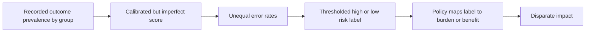

# Lecture 2: Fair Prediction, Conflicting Error Rates, and Disparate Impact

## Course notes on Chouldechova, *Fair Prediction with Disparate Impact*

**Primary source:** Alexandra Chouldechova, [“Fair prediction with disparate impact: A study of bias in recidivism prediction instruments”](https://arxiv.org/abs/1610.07524), FATML 2016, 6-page conference paper.

**Format:** Self-contained course-note chapter. Page references below refer to the pages of the source PDF.

## Learning objectives

After studying these notes, you should be able to:

1. Explain why two defensible audits of the same risk score can reach apparently contradictory conclusions.
2. Define groupwise calibration, positive predictive value, prevalence, false-positive rate, and false-negative rate.
3. Read each confusion-matrix metric by identifying its conditioning population.
4. Derive the paper's relationship among prevalence, positive predictive value, false-positive rate, and false-negative rate.
5. Explain why unequal prevalences create a tradeoff between predictive parity and equal error rates for an imperfect classifier.
6. Reproduce the tradeoff with a numerical example.
7. Translate a disparity in classification errors into a disparity in expected penalties under the paper's MinMax policy.
8. Explain why the meaning of a “high-risk” decision depends on whether it triggers a burden or a benefit.
9. Interpret total variation distance as a bound on policy-induced disparity.
10. State what the paper's result proves, what assumptions it uses, and what normative questions it leaves unresolved.

---

## 1. The puzzle: how can a calibrated score still produce unequal mistakes?

Risk scores are used to estimate whether a defendant will experience a future outcome such as rearrest or reconviction. In practice, a score may inform pretrial release, bail, parole, supervision, or sentencing. A high-risk classification can therefore change a person's liberty or legal burden.

The paper begins from a public disagreement about COMPAS, a recidivism prediction instrument. Two styles of audit emphasized different quantities:

| Audit perspective | Question asked | Finding discussed in the paper |
|---|---|---|
| Psychometric test fairness | Among people receiving the same score, is the observed outcome rate similar across racial groups? | COMPAS appeared approximately fair by this criterion for race |
| Error-rate comparison | Among people who did not recidivate, how often were they labeled high risk? Among those who did, how often were they labeled low risk? | False-positive and false-negative rates differed substantially by race |

These claims sound inconsistent only if every fairness measure is assumed to capture the same property. Chouldechova's key contribution is to show mathematically that they do not.

When outcome prevalence differs across groups, an imperfect score generally cannot simultaneously satisfy both of the following:

- the same meaning for a high-risk prediction across groups; and
- the same false-positive and false-negative rates across groups.

The paper then takes a second step. It connects unequal error rates to downstream decisions. If a high-risk label triggers a stricter penalty, different error rates can produce different expected penalties even when the score is calibrated.

### A mental picture: two lenses aimed at the same classifier

Imagine two auditors standing on opposite sides of a confusion matrix.

- One starts with the **prediction**: “Of those labeled high risk, what fraction later have the outcome?”
- The other starts with the **outcome**: “Of those without the outcome, what fraction were labeled high risk?”

They use the same cases but different denominators. The disagreement is not an arithmetic mistake. It is a disagreement about which conditional error matters.

### Check your understanding

1. Why is “the score is fair” incomplete unless the speaker identifies a fairness criterion?
2. Why might a false positive matter especially when a high-risk label increases a person's legal burden?

---

## 2. Data, notation, and the prediction task

The empirical analysis uses the Broward County dataset released by ProPublica. It contains COMPAS decile scores, recorded two-year recidivism outcomes, demographic variables, and crime-related variables. The paper restricts its comparison to defendants recorded as African-American or Caucasian; these notes use **Black** and **White**, matching the labels in the paper's figures (p. 2).

The paper introduces three variables:

| Symbol | Meaning |
|---|---|
| $X=x$ | Covariates describing a person and case |
| $S=S(x)$ | Risk score computed from the covariates; larger values indicate greater assessed risk |
| $R\in\{b,w\}$ | Recorded racial group: Black or White |
| $Y\in\{0,1\}$ | Recorded outcome; $Y=1$ denotes recidivism |

The score is not itself a decision. A decision-maker can turn it into a binary label by choosing a threshold $s_{HR}$:

$$
S_c(x)=
\begin{cases}
HR, & S(x)>s_{HR},\\
LR, & S(x)\le s_{HR}.
\end{cases}
$$

Here, $HR$ means “classified high risk,” and $LR$ means “classified low risk.” This conversion is called **coarsening** because a multi-valued score is reduced to two categories.

### 2.1 The confusion matrix

Once the score is thresholded, every case falls into one of four cells:

| Observed outcome | Classified low risk | Classified high risk |
|---|---:|---:|
| $Y=0$: no recorded recidivism | True negative (TN) | False positive (FP) |
| $Y=1$: recorded recidivism | False negative (FN) | True positive (TP) |

The words *positive* and *negative* refer to the classifier's high- or low-risk prediction. The words *true* and *false* indicate whether that prediction agrees with the observed outcome.

This naming convention can obscure the human meaning. In a punitive use case:

- a false positive is a non-recidivating person who may receive a stricter penalty;
- a false negative is a recidivating person who was classified low risk.

### 2.2 Read a metric by reading its denominator

The central metrics divide the same four cells in different ways:

| Metric | Formula | Conditioning population | Plain-language question |
|---|---|---|---|
| Prevalence | $p=P(Y=1)$ | Everyone in a group | How common is the recorded outcome? |
| Positive predictive value | $PPV=\frac{TP}{TP+FP}$ | People labeled high risk | How often is a high-risk label followed by the outcome? |
| False-positive rate | $FPR=\frac{FP}{FP+TN}$ | People with $Y=0$ | How often is a non-recidivator labeled high risk? |
| False-negative rate | $FNR=\frac{FN}{FN+TP}$ | People with $Y=1$ | How often is a recidivator labeled low risk? |
| True-positive rate | $TPR=1-FNR$ | People with $Y=1$ | How often is a recidivator labeled high risk? |

The denominator is the fastest way to keep these concepts straight. $PPV$ conditions on the **prediction**. $FPR$ and $FNR$ condition on the **outcome**.

### Worked example: one confusion matrix, several stories

Suppose a group contains 200 people:

| Observed outcome | Low risk | High risk | Total |
|---|---:|---:|---:|
| $Y=0$ | 90 | 30 | 120 |
| $Y=1$ | 20 | 60 | 80 |
| Total | 110 | 90 | 200 |

Then:

$$
p=\frac{80}{200}=0.40,
\qquad
PPV=\frac{60}{90}=0.667,
$$

$$
FPR=\frac{30}{120}=0.25,
\qquad
FNR=\frac{20}{80}=0.25.
$$

The classifier has the same numerical value for $FPR$ and $FNR$ in this example, but the two rates describe different people and different harms.

### Check your understanding

1. Why does $PPV$ use $TP+FP$ rather than every person who recidivated?
2. If a decision-maker raises the high-risk threshold, which two error rates would you normally expect to move in opposite directions?

---

## 3. Test fairness: equal scores should carry equal empirical meaning

The paper draws its first fairness criterion from psychometrics. A score is **test-fair**, or groupwise calibrated, when a given score corresponds to the same observed outcome probability in each group:

$$
P(Y=1\mid S=s,R=b)
=
P(Y=1\mid S=s,R=w)
\quad\text{for every score }s.
$$

Term by term:

- $Y=1$ is the event the score is intended to predict.
- $S=s$ restricts attention to people assigned a particular score.
- $R=b$ or $R=w$ selects a racial group.
- Equality means that group membership supplies no additional difference in the observed outcome rate once the score is fixed.

### Worked example: interpreting a score of 7

Suppose that among Black defendants with score 7, 70 of 100 recidivate, and among White defendants with score 7, 35 of 50 recidivate.

$$
P(Y=1\mid S=7,R=b)=\frac{70}{100}=0.70,
$$

$$
P(Y=1\mid S=7,R=w)=\frac{35}{50}=0.70.
$$

At score 7, the score has the same empirical interpretation in the two groups: about 70% of each score-defined group has the recorded outcome. Test fairness would require this equality across the full score range, not merely at one score.

### 3.1 Predictive parity after thresholding

For the coarsened high/low classifier, the corresponding condition is that a high-risk label has the same positive predictive value across groups:

$$
P(Y=1\mid S_c=HR,R=b)
=
P(Y=1\mid S_c=HR,R=w).
$$

This condition is often called **predictive parity**. In the paper's binary analysis, equal $PPV$ is treated as the necessary calibration constraint that connects test fairness to the confusion matrix (p. 2).

Calibration is appealing because it asks that a score mean the same thing wherever it is used. If “high risk” corresponds to a 60% observed outcome rate for one group but 30% for another, identical labels conceal different empirical risks.

Calibration does not describe how errors are distributed. Two groups may share the same $PPV$ while having different $FPR$ and $FNR$. That tension is the mathematical center of the paper.

---

## 4. The key identity linking calibration, prevalence, and errors

Let

$$
p=P(Y=1)
$$

be the prevalence of the outcome in a group. Chouldechova relates prevalence and $PPV$ to the two error rates:

$$
\boxed{
FPR=
\frac{p}{1-p}
\cdot
\frac{1-PPV}{PPV}
\cdot
(1-FNR)
}
\tag{1}
$$

Read it in words as: **prevalence odds times false-discovery odds times the true-positive rate**.

### 4.1 Derivation from a unit-sized population

Imagine a group with total population normalized to 1.

1. A fraction $p$ has $Y=1$.
2. Of those people, a fraction $1-FNR$ is correctly labeled high risk.
3. Therefore the true-positive mass is

   $$
   TP=p(1-FNR).
   $$

4. A fraction $1-p$ has $Y=0$.
5. Of those people, a fraction $FPR$ is incorrectly labeled high risk.
6. Therefore the false-positive mass is

   $$
   FP=(1-p)FPR.
   $$

Now substitute these quantities into the definition of positive predictive value:

$$
PPV=\frac{TP}{TP+FP}
=
\frac{p(1-FNR)}{p(1-FNR)+(1-p)FPR}.
$$

Multiply both sides by the denominator:

$$
PPV\,[p(1-FNR)+(1-p)FPR]
=p(1-FNR).
$$

Move the true-positive term on the left to the right:

$$
PPV(1-p)FPR
=p(1-FNR)(1-PPV).
$$

Divide by $PPV(1-p)$:

$$
FPR=
\frac{p}{1-p}
\cdot
\frac{1-PPV}{PPV}
\cdot
(1-FNR).
$$

This is Equation (2.4) in the paper (p. 3).

### 4.2 What each factor does

| Factor | Interpretation | Effect when it increases, holding the other factors fixed |
|---|---|---|
| $\frac{p}{1-p}$ | Outcome prevalence expressed as odds | Required $FPR$ increases |
| $\frac{1-PPV}{PPV}$ | False-to-true ratio among high-risk predictions | Required $FPR$ increases |
| $1-FNR=TPR$ | Fraction of outcome-positive cases labeled high risk | Required $FPR$ increases |

The first factor creates the cross-group tension. If two groups have the same $PPV$ and the same $FNR$, but different prevalences, Equation (1) forces their $FPR$ values to differ.

Conversely, if two groups have the same $PPV$ and the same $FPR$, differing prevalences force their $FNR$ values to differ.

### 4.3 Odds form: the structure becomes easier to see

Rearranging the $PPV$ formula also gives:

$$
\frac{PPV}{1-PPV}
=
\frac{p}{1-p}
\cdot
\frac{TPR}{FPR}.
$$

This says:

$$
\text{odds after a high-risk label}
=
\text{base odds}
\times
\text{classifier likelihood ratio}.
$$

If base odds differ but post-label odds must be equal, the classifier's error-rate ratio cannot remain identical across groups unless the prediction is perfect or another degenerate exception applies.

### Check your understanding

1. In Equation (1), why does prevalence enter as odds $p/(1-p)$ rather than as $p$ alone?
2. If two groups have equal $PPV$, equal $FNR$, and unequal $p$, which metric must differ?

---

## 5. Worked tradeoff: equal PPV and FNR force unequal FPR

Consider two groups of 600 people. Suppose the classifier has $FNR=20\%$ in both groups, and a high-risk label has $PPV=60\%$ in both groups. The groups differ only in outcome prevalence.

### Group A: prevalence $p_A=50\%$

- Outcome-positive people: $600\times 0.50=300$.
- With $FNR=20\%$, false negatives: $300\times 0.20=60$.
- True positives: $300-60=240$.
- For $PPV=60\%$, 240 true positives must be 60% of all high-risk labels.
- Total high-risk labels: $240/0.60=400$.
- False positives: $400-240=160$.
- Outcome-negative people: $600-300=300$.
- Therefore:

  $$
  FPR_A=\frac{160}{300}=53.3\%.
  $$

### Group B: prevalence $p_B=25\%$

- Outcome-positive people: $600\times 0.25=150$.
- With $FNR=20\%$, false negatives: $150\times0.20=30$.
- True positives: $150-30=120$.
- For $PPV=60\%$, total high-risk labels: $120/0.60=200$.
- False positives: $200-120=80$.
- Outcome-negative people: $600-150=450$.
- Therefore:

  $$
  FPR_B=\frac{80}{450}=17.8\%.
  $$

### Comparison

| Quantity | Group A | Group B | Equal across groups? |
|---|---:|---:|---:|
| Prevalence | 50% | 25% | No |
| PPV | 60% | 60% | Yes |
| FNR | 20% | 20% | Yes |
| FPR | 53.3% | 17.8% | **No** |

The high-risk label is equally reliable in the two groups, and the classifier misses the same fraction of outcome-positive cases. Yet the classifier must falsely label a much larger share of Group A's outcome-negative cases as high risk.

### Why the result is not a paradox

Group A contains twice as many outcome-positive people. With the same true-positive rate, it therefore produces more true positives. To keep true positives at 60% of high-risk predictions, the classifier also needs more false positives. Those false positives are divided by a smaller outcome-negative population, so Group A's $FPR$ becomes much higher.

This is the paper's core impossibility result in concrete form. For an imperfect predictor, unequal prevalences make predictive parity incompatible with simultaneous equality of both error rates.

### Important interpretive caution

The algebra treats group prevalence as a statistical input. It does not explain why prevalence differs, show that the difference is inherent to a group, or establish that the recorded outcome is a complete measure of underlying behavior. Those are separate causal, measurement, and social questions.

---

## 6. The COMPAS case in the paper

The paper reports that observed two-year recidivism prevalence was 51% among Black defendants and 39% among White defendants in the analyzed Broward County data (p. 3).

It also reports the following thresholded error rates:

| Group | Prevalence | False-positive rate | False-negative rate |
|---|---:|---:|---:|
| Black defendants | 51% | 45% | 28% |
| White defendants | 39% | 23% | 48% |

The direction matches Equation (1): the group with higher observed prevalence has the higher false-positive rate and lower false-negative rate.

### 6.1 Reading the four percentages correctly

- The 45% $FPR$ means that, among Black defendants who did not recidivate, 45% were classified high risk.
- The 23% $FPR$ means that, among White defendants who did not recidivate, 23% were classified high risk.
- The 28% $FNR$ means that, among Black defendants who did recidivate, 28% were classified low risk.
- The 48% $FNR$ means that, among White defendants who did recidivate, 48% were classified low risk.

The comparison therefore exposes two different disparities:

| Outcome-defined population | Difference in high-risk treatment |
|---|---|
| Non-recidivators | Black defendants were more often classified high risk: $45\%-23\%=22$ percentage points |
| Recidivators | Because $TPR=1-FNR$, Black defendants were more often classified high risk: $72\%-52\%=20$ percentage points |

In both outcome strata, the simple binary classifier assigns high risk more often to Black defendants. Whether and how that classification becomes harm depends on what decision follows.

### 6.2 Approximate PPV check

The published percentages are rounded, but they can be used to check the calibration logic.

For Black defendants, normalize the group size to 1:

$$
TP=0.51(1-0.28)=0.3672,
$$

$$
FP=(1-0.51)(0.45)=0.2205,
$$

$$
PPV_b\approx\frac{0.3672}{0.3672+0.2205}=0.625.
$$

For White defendants:

$$
TP=0.39(1-0.48)=0.2028,
$$

$$
FP=(1-0.39)(0.23)=0.1403,
$$

$$
PPV_w\approx\frac{0.2028}{0.2028+0.1403}=0.591.
$$

The values are reasonably close but not identical. That is consistent with the paper's claim of approximate rather than exact calibration and with the use of rounded summary statistics.

### Check your understanding

1. Why does a 45% false-positive rate not mean that 45% of all Black defendants were falsely classified?
2. Which reported disparity would be emphasized by an audit focused on unnecessary punitive treatment of non-recidivators?

---

## 7. From predictions to consequences: the MinMax penalty policy

Error-rate differences are statistical. To analyze disparate impact, the paper specifies how a prediction affects a decision.

Suppose a policy permits penalties between a low value $t_L$ and a high value $t_H$. The paper's **MinMax policy** assigns the endpoints:

$$
T_{MinMax}=
\begin{cases}
t_L, & S_c=LR,\\
t_H, & S_c=HR.
\end{cases}
$$

The word *penalty* is used broadly. It may represent a sentence, bail amount, or another adverse legal consequence. The analysis is specifically about settings in which a high-risk assessment produces a stricter outcome (pp. 3-4).

### 7.1 Rewrite the policy as an indicator equation

Let $\mathbb{1}\{S_c=HR\}$ equal 1 for a high-risk classification and 0 otherwise. Then:

$$
T=t_L+(t_H-t_L)\mathbb{1}\{S_c=HR\}.
$$

This expression separates two pieces:

- everyone receives the baseline $t_L$;
- a high-risk classification adds the gap $t_H-t_L$.

For group $r$ and observed outcome $y$, take a conditional expectation:

$$
E[T\mid R=r,Y=y]
=t_L+(t_H-t_L)P(S_c=HR\mid R=r,Y=y).
$$

Subtract the White-group expectation from the Black-group expectation. The common baseline cancels:

$$
\Delta(y_1,y_2)
=(t_H-t_L)
\left[
P(S_c=HR\mid R=b,Y=y_1)
-P(S_c=HR\mid R=w,Y=y_2)
\right].
\tag{2}
$$

This is Proposition 3.1. It says that expected penalty disparity equals:

$$
\text{penalty gap}
\times
\text{difference in high-risk classification probability}.
$$

### 7.2 Corollary for non-recidivators

For people with $Y=0$, the probability of a high-risk label is the false-positive rate. Set $y_1=y_2=0$ in Equation (2):

$$
\boxed{
\Delta_{Y=0}
=(t_H-t_L)(FPR_b-FPR_w)
}
\tag{3}
$$

Using the paper's COMPAS error rates:

$$
\Delta_{Y=0}
=(t_H-t_L)(0.45-0.23)
=0.22(t_H-t_L).
$$

Thus, among non-recidivators, the expected Black-White penalty difference is 22% of the full low-to-high penalty gap under this policy.

### 7.3 Corollary for recidivators

For people with $Y=1$, the probability of a high-risk label is the true-positive rate:

$$
P(HR\mid Y=1)=TPR=1-FNR.
$$

Therefore:

$$
\Delta_{Y=1}
=(t_H-t_L)[(1-FNR_b)-(1-FNR_w)],
$$

which simplifies to:

$$
\boxed{
\Delta_{Y=1}
=(t_H-t_L)(FNR_w-FNR_b)
}
\tag{4}
$$

Using the reported values:

$$
\Delta_{Y=1}
=(t_H-t_L)(0.48-0.28)
=0.20(t_H-t_L).
$$

Among recidivators, the expected Black-White penalty difference is 20% of the full penalty gap.

### Worked example: incarceration versus a noncustodial alternative

Let $t_L=0$ represent no incarceration and $t_H=1$ represent some incarceration. For non-recidivators:

$$
P(T=1\mid R=b,Y=0)=FPR_b=0.45,
$$

$$
P(T=1\mid R=w,Y=0)=FPR_w=0.23.
$$

The absolute difference is 22 percentage points. The relative likelihood is:

$$
\frac{0.45}{0.23}\approx1.96.
$$

Under this stylized policy, a non-recidivating Black defendant is therefore about 1.96 times as likely as a non-recidivating White defendant to receive incarceration.

The result does not claim that every real judge follows a binary MinMax rule. The model isolates the mechanism by which classification disparities can become decision disparities.

### Check your understanding

1. Why does the baseline penalty $t_L$ disappear when comparing expected penalties across groups?
2. If the gap $t_H-t_L$ doubles and classification rates stay fixed, what happens to $\Delta$?

---

## 8. Context changes the meaning of an error

The paper carefully limits its penalty analysis. A high-risk classification is not always used to impose a burden. Some instruments allocate services, supervision resources, or treatment intended to reduce risk. In that setting, a high-risk label may trigger a benefit rather than a stricter penalty (p. 3).

| Use of high-risk label | Possible consequence of a false positive | Possible consequence of a false negative |
|---|---|---|
| Punitive: stricter bail, sentence, or confinement | Unnecessary burden on a person without the outcome | A person with the outcome avoids the stricter burden |
| Supportive: treatment or risk-reduction service | Resources go to someone who may not need them most | A person who could benefit is denied the service |

The same confusion matrix can therefore have different ethical meaning under different policies.

This yields a general lesson:

$$
\text{fairness of a score}
\neq
\text{fairness of the system using the score}.
$$

A system-level evaluation needs at least three ingredients:

1. the score's statistical properties;
2. the decision rule that converts scores into actions; and
3. the value and distribution of the resulting benefits and burdens.

Calibration alone supplies only the first ingredient.

---

## 9. Aggregate balance may hide subgroup imbalance

One possible response to the paper's tradeoff is to deliberately equalize error rates across broad racial groups, accepting that predictive parity will no longer hold. Chouldechova warns that aggregate equality is not the end of the analysis.

Even if

$$
FPR_b=FPR_w
$$

overall, the rates can still differ within categories such as prior-record count or offense severity.

### Worked example: equality in aggregate, inequality within strata

Consider two prior-record strata, each with group-specific false-positive rates:

| Prior-record stratum | Group A FPR | Group B FPR |
|---|---:|---:|
| Low prior count | 10% | 20% |
| High prior count | 40% | 50% |

Within both strata, Group A's FPR is 10 points lower. Yet different group proportions across strata can make the overall rates equal or even reverse their ordering. This is a form of aggregation sensitivity associated with Simpson's paradox.

The paper's Figure 2 examines defendants charged with misdemeanors and breaks false-positive rates down by prior-count ranges. Substantial Black-White differences persist even among lower-prior-count subgroups (p. 4). The empirical point is not merely that the groups had different mixes of serious cases.

### The granularity problem

An auditor must choose the level at which parity is desired:

- across broad racial groups;
- within outcome classes;
- within criminal-history categories;
- within offense categories;
- or across intersections of several attributes.

Finer conditioning can expose hidden disparities, but it also produces smaller samples and noisier estimates. Statistics can measure the resulting tradeoff. They cannot decide by themselves which grouping is ethically or legally appropriate.

---

## 10. Bounding disparity with total variation distance

The paper next connects policy disparity to the separation between score distributions.

Let $f_{b,y}(s)$ and $f_{w,y}(s)$ be the score distributions for Black and White defendants within outcome class $Y=y$. Their **total variation distance** is

$$
d_{TV}(f_{b,y},f_{w,y})
=
\frac{1}{2}\int
\left|f_{b,y}(s)-f_{w,y}(s)\right|ds.
$$

For discrete scores, replace the integral with a sum.

An equivalent and more intuitive definition is:

$$
d_{TV}(P,Q)=\sup_A |P(A)-Q(A)|.
$$

It is the largest possible probability difference the two distributions assign to the same event $A$.

### 10.1 Why total variation bounds penalty disparity

A threshold defines an event:

$$
A=\{s:s>s_{HR}\}.
$$

This is exactly the event “classified high risk.” By the definition of total variation:

$$
\left|
P(HR\mid R=b,Y=y)
-P(HR\mid R=w,Y=y)
\right|
\le d_{TV}(f_{b,y},f_{w,y}).
$$

Multiplying both sides by the penalty gap gives the magnitude form of the paper's Proposition 3.2:

$$
\boxed{
|\Delta_y|
\le
(t_H-t_L)d_{TV}(f_{b,y},f_{w,y})
}
\tag{5}
$$

The result is **sharp**: without additional information about the distributions, total variation is the smallest universal upper bound on the probability difference over all possible high-risk sets.

### Worked example

Suppose the within-outcome score distributions have total variation distance 0.18, and the policy's penalty gap is 10 units.

$$
|\Delta_y|\le10(0.18)=1.8.
$$

No threshold-based MinMax policy can create more than 1.8 units of expected penalty difference within that outcome class. A particular threshold may create less.

### 10.2 The empirical score-distribution comparison

For the overall Black and White COMPAS decile score distributions shown in Figure 3, the paper reports:

- Cohen's $d=0.60$;
- total variation, interpreted as distributional non-overlap, of 24.5%.

Cohen's $d$ standardizes a mean difference using a pooled standard deviation. It is most natural for roughly bell-shaped distributions. COMPAS scores are visibly non-normal, so total variation provides a more direct distribution-wide comparison.

The 24.5% figure describes the overall score distributions in the figure. Proposition 3.2's policy bound uses distributions conditioned on an outcome $y$. Keeping those objects separate prevents an overall effect-size statistic from being mistaken for a particular within-outcome penalty bound.

### Check your understanding

1. If two groups have identical score distributions within $Y=0$, what does Equation (5) imply about false-positive-driven penalty disparity?
2. Why is total variation more directly suited than a difference in means to bounding the effect of a threshold?

---

## 11. What the paper proves—and what it does not

The argument is strongest when its mathematical result and normative interpretation are kept separate.

### 11.1 Claims supported by the analysis

- A calibrated risk score can have unequal false-positive and false-negative rates across groups.
- With unequal group prevalences, equal $PPV$ generally conflicts with simultaneously equal $FPR$ and $FNR$ for an imperfect predictor.
- When high-risk labels trigger stricter penalties, unequal error rates can produce unequal expected penalties.
- Overall error-rate balance does not guarantee balance within finer subgroups.
- Separation between group score distributions bounds the disparity produced by a binary threshold policy.

### 11.2 Claims not established by the analysis

- Calibration is the uniquely correct definition of fairness.
- Equal error rates are the uniquely correct definition of fairness.
- A prevalence difference is natural, immutable, or causally explained by race.
- The observed recidivism label perfectly measures underlying offending behavior.
- A risk score should or should not be used in any particular legal setting.
- The MinMax rule completely represents real judicial decision-making.
- A statistically fair instrument guarantees a fair institution.

### 11.3 Assumptions that make the result legible

| Simplification | What it enables | What a real deployment would add |
|---|---|---|
| Binary observed outcome | A standard confusion matrix | Multiple outcomes, censoring, and timing |
| Binary high/low classification | Direct error-rate comparison | Multi-level scores and several thresholds |
| Two recorded racial groups | A focused pairwise comparison | More groups and intersectional analysis |
| Fixed outcome label | Clean algebra | Measurement error and policy-dependent outcomes |
| MinMax penalty rule | Closed-form impact expressions | Judicial discretion, guidelines, and heterogeneous consequences |
| Static evaluation | One-period comparison | Feedback between decisions and future outcomes |

The simplified model is useful because it makes the conflict visible. Its value is analytical clarity, not a claim that the justice system is literally binary.

---

## 12. Choosing a fairness criterion is a policy decision

The paper's mathematics rules out an easy escape: when prevalences differ and prediction is imperfect, a designer cannot promise every attractive parity condition at once.

The remaining choice depends on the decision context.

| Criterion | Protects or emphasizes | Potential concern |
|---|---|---|
| Groupwise calibration / predictive parity | The same score or high-risk label has the same empirical meaning | Error burdens may differ across groups |
| Equal false-positive rates | Outcome-negative people face the same chance of an adverse high-risk label | $PPV$ or other error rates may differ |
| Equal false-negative rates | Outcome-positive people face the same chance of being missed | $PPV$ or false-positive rates may differ |
| Equalized odds | Both $FPR$ and $TPR$ are equal | Predictive parity generally fails when prevalences differ |

The correct emphasis cannot be inferred from the score alone. It depends on questions such as:

- What action follows a high-risk classification?
- How severe and reversible are false-positive and false-negative consequences?
- Which people bear those consequences?
- Is the observed outcome an adequate target?
- What legal or ethical commitments constrain the decision?
- Are there less harmful alternatives to prediction-driven allocation?

Chouldechova stresses that fairness and disparate impact are social and ethical concepts, not purely statistical ones (pp. 1-2). Statistics can reveal that goals conflict and quantify the consequences of a policy. It cannot choose the governing value judgment.

---

## 13. Why the paper mattered

This short paper helped make a durable lesson in algorithmic fairness precise: **fairness criteria are not interchangeable, and some cannot be jointly achieved except in special cases**.

Its contribution has three layers:

1. **Conceptual:** it explains how a score can look fair under calibration and unfair under error-rate comparison without either audit being arithmetically mistaken.
2. **Mathematical:** it derives the exact relationship among prevalence, predictive value, and classification errors.
3. **Institutional:** it shows how score disparities become disparities in treatment only through a policy that assigns consequences.

Independent concurrent work by Kleinberg, Mullainathan, and Raghavan established a closely related incompatibility among calibration and balance conditions. Together, these results became central examples of fairness tradeoffs in machine learning.

The paper does not conclude that data-driven tools should automatically be abandoned. It notes evidence that statistical instruments can outperform professional judgment and that human decisions can also exhibit racial bias. The practical message is to evaluate an instrument for the particular context in which it will be used, including the harms created by the decision rule (p. 5).

### A compact causal chain

The arrows should not be read as saying that prevalence differences are inevitable or that the outcome is measured without error. They show the logical flow inside the paper's model.

---

## 14. A practical audit checklist

When examining a risk score, use the following sequence.

### Step 1: Define the target

- What exactly counts as $Y=1$?
- Is it behavior, arrest, charge, conviction, or another recorded event?
- Over what time horizon is it measured?

### Step 2: Identify the decision

- Is the score advisory or determinative?
- Which threshold creates a high-risk label?
- Does that label trigger a burden, a benefit, or both?

### Step 3: Report base rates

- What is $P(Y=1\mid R=r)$ for each group?
- Could differences reflect measurement, selection, or unequal social conditions?

### Step 4: Audit several conditional quantities

- Calibration across the score range;
- $PPV$ and, where relevant, negative predictive value;
- $FPR$, $FNR$, and overall accuracy;
- uncertainty intervals, not only point estimates.

### Step 5: Disaggregate

- Do aggregate patterns persist within legally or operationally relevant strata?
- Are sample sizes large enough for reliable subgroup estimates?

### Step 6: Translate metrics into consequences

- What is the low-to-high burden gap $t_H-t_L$?
- What expected disparity follows from the observed classification-rate gap?
- How reversible are erroneous decisions?

### Step 7: Make the value choice explicit

- Which mistakes are treated as most serious, and why?
- Who participated in choosing the fairness criterion?
- What alternatives exist outside the scoring system?

---

## 15. Synthesis

The paper begins with an apparent contradiction: COMPAS could be approximately calibrated across racial groups while producing sharply different false-positive and false-negative rates.

The contradiction disappears once the denominators are made explicit. Calibration asks about outcomes among people receiving a prediction. Error rates ask about predictions among people sharing an outcome. Bayes' rule connects the two through group prevalence.

For an imperfect classifier:

$$
\text{unequal prevalence}
+
\text{equal predictive value}
\Longrightarrow
\text{some unequal error rate}.
$$

The paper then moves from prediction to impact. Under a policy in which high risk receives the high penalty, expected disparity is simply the penalty gap multiplied by the group difference in high-risk classification rates.

This two-stage structure is the central lesson:

1. **Statistical constraints determine which metric combinations are possible.**
2. **Institutions determine what those metrics do to people.**

Fairness analysis needs both stages. A metric can diagnose a pattern, but only the surrounding social and decision context tells us which pattern is harmful and what should change.

---

## Glossary

**Calibration:** Agreement between a predicted score and the observed outcome frequency among people receiving that score.

**Cohen's $d$:** A standardized difference in group means, calculated using a pooled standard deviation.

**Coarsening:** Converting a multi-valued score into fewer categories, such as high and low risk.

**Disparate impact:** In the paper's usage, an unintended disproportionate adverse effect of a policy on a group.

**Equalized odds:** Equality across groups of both the true-positive rate and false-positive rate.

**False negative (FN):** A case with $Y=1$ classified low risk.

**False-negative rate (FNR):** The fraction of outcome-positive cases classified low risk, $FN/(FN+TP)$.

**False positive (FP):** A case with $Y=0$ classified high risk.

**False-positive rate (FPR):** The fraction of outcome-negative cases classified high risk, $FP/(FP+TN)$.

**MinMax policy:** The paper's stylized policy that assigns the lowest permitted penalty to low-risk classifications and the highest permitted penalty to high-risk classifications.

**Positive predictive value (PPV):** The fraction of high-risk classifications followed by the observed outcome, $TP/(TP+FP)$.

**Predictive parity:** Equality of positive predictive value across groups.

**Prevalence / base rate:** The fraction of a group with the observed outcome, $P(Y=1\mid R=r)$.

**Recidivism prediction instrument (RPI):** A scoring tool intended to estimate a person's future recidivism risk.

**Test fairness:** The psychometric criterion that the same score corresponds to the same observed outcome probability across groups.

**Total variation distance:** The maximum probability difference that two distributions assign to the same event; equivalently, half the integral or sum of their absolute density difference.

**True-positive rate (TPR):** The fraction of outcome-positive cases classified high risk; $TPR=1-FNR$.

---

## Review and exam-style questions

### Short answer

1. Explain why calibration and false-positive-rate parity condition on different populations.
2. What does it mean for a score of 7 to be calibrated across two groups?
3. Why can unequal prevalence make equal $PPV$, $FPR$, and $FNR$ mutually incompatible?
4. Explain why a high-risk false positive has different ethical meaning in punitive and supportive applications.
5. What role does the threshold $s_{HR}$ play in turning a score into a decision?
6. Why does overall error-rate equality not guarantee equality within prior-record strata?
7. What does total variation distance measure that Cohen's $d$ may miss?
8. Why is the MinMax analysis a model of one mechanism rather than a full description of judicial practice?
9. Give two causal or measurement questions that the paper's algebra does not answer.
10. Explain the statement: “A fair score does not guarantee a fair system.”

### Analytical problems

1. **Compute the metrics.** A group has $TP=180$, $FP=120$, $TN=480$, and $FN=20$. Compute prevalence, $PPV$, $FPR$, $FNR$, and $TPR$.

2. **Verify the identity.** Use your answers from Problem 1 to verify Equation (1). Show every factor.

3. **Construct the tradeoff.** Two groups each contain 1,000 people. Their prevalences are 40% and 20%. Both must have $PPV=50\%$ and $FNR=25\%$. Construct both confusion matrices and compare their false-positive rates.

4. **Penalty disparity.** Suppose $t_L=2$, $t_H=8$, $FPR_b=0.35$, and $FPR_w=0.20$. Calculate the expected Black-White penalty difference among non-recidivators under the MinMax policy.

5. **Recidivator disparity.** With the same penalty range, let $FNR_b=0.15$ and $FNR_w=0.35$. Calculate the expected penalty difference among recidivators and explain the sign.

6. **Threshold reasoning.** A decision-maker raises $s_{HR}$. Predict the usual direction of change in $FPR$, $FNR$, and the number of high-risk classifications. Explain why $PPV$ need not stay fixed.

7. **Total variation bound.** If $d_{TV}(f_{b,0},f_{w,0})=0.12$ and $t_H-t_L=15$, what is the largest possible magnitude of expected penalty disparity among non-recidivators under the model?

8. **Audit design.** Design an audit that distinguishes calibration, predictive parity, and equalized odds. State the data required and the denominator of every reported rate.

### Discussion prompts

1. In a pretrial setting, should avoiding false positives take priority over calibration? Defend a position using the consequences of each error.
2. If recorded recidivism partly reflects unequal policing, how should that affect interpretation of the prevalence term in the theorem?
3. Is group-specific thresholding acceptable if it reduces a severe error-rate disparity? What competing values does it raise?
4. Who should decide the subgroup granularity at which parity is assessed?
5. When might the right intervention be to change the legal policy rather than recalibrate the score?

---

## Further reading

- Alexandra Chouldechova, [“Fair prediction with disparate impact: A study of bias in recidivism prediction instruments”](https://arxiv.org/abs/1610.07524) (2016): the primary reading for these notes.
- Jon Kleinberg, Sendhil Mullainathan, and Manish Raghavan, [“Inherent Trade-Offs in the Fair Determination of Risk Scores”](https://arxiv.org/abs/1609.05807) (2016): an independent formal treatment of incompatible risk-score fairness conditions.
- Julia Angwin, Jeff Larson, Surya Mattu, and Lauren Kirchner, [“Machine Bias”](https://www.propublica.org/article/machine-bias-risk-assessments-in-criminal-sentencing) (2016): the investigation that foregrounded racial error-rate differences in COMPAS.
- Sam Corbett-Davies and Sharad Goel, [“The Measure and Mismeasure of Fairness”](https://arxiv.org/abs/1808.00023) (2018): a broader discussion of statistical fairness criteria and decision-making.
- Moritz Hardt, Eric Price, and Nati Srebro, [“Equality of Opportunity in Supervised Learning”](https://arxiv.org/abs/1610.02413) (2016): formalizes equalized odds and equality of opportunity.

## One-sentence takeaway

**When groups have different observed outcome prevalences, an imperfect calibrated predictor cannot generally equalize its error rates, and the resulting statistical disparity becomes social harm only through the policy that acts on the prediction.**
