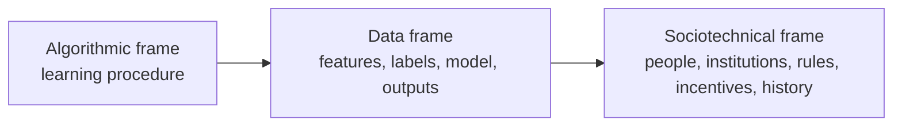
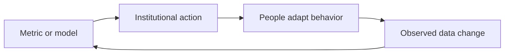
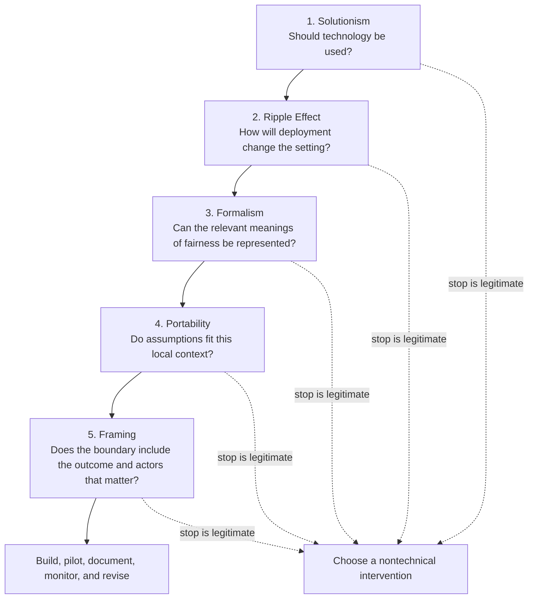

# Lecture 2: Fairness and Abstraction in Sociotechnical Systems

## Course notes on Selbst et al., *Fairness and Abstraction in Sociotechnical Systems*

**Primary source:** Andrew D. Selbst, danah boyd, Sorelle A. Friedler, Suresh Venkatasubramanian, and Janet Vertesi, [“Fairness and Abstraction in Sociotechnical Systems”](https://doi.org/10.1145/3287560.3287598), *FAT\** 2019, pp. 59-68.

**Format:** Self-contained course-note chapter. Page references below refer to the printed page numbers in the paper.

## Learning objectives

After studying these notes, you should be able to:

1. Explain why fairness is a property of a sociotechnical system rather than of an isolated model.
2. Distinguish the algorithmic, data, and sociotechnical frames.
3. Recognize the Framing, Portability, Formalism, Ripple Effect, and Solutionism Traps.
4. Explain how a locally valid fairness guarantee can fail to produce a fair social outcome.
5. Describe fairness as procedural, contextual, and contestable.
6. Use heterogeneous engineering, user scripts, and the Social Construction of Technology framework to analyze an ML system.
7. Anticipate reinforcement politics, reactivity, and shifts in institutional values after deployment.
8. Apply the paper's reverse-order design process to a high-stakes decision system.
9. Identify when the responsible conclusion may be not to build a technical system.

---

## 1. The central argument: a fair component does not make a fair system

Computer science depends on abstraction. We hide internal detail, draw a boundary around a manageable object, and judge that object through its inputs, outputs, and guarantees. This practice makes software modular, reusable, and tractable.

The paper's warning is not that abstraction is inherently bad. The warning is that the location of the abstraction boundary becomes a moral and political choice when a system is supposed to deliver fairness, justice, or due process.

A machine-learning model is only one component in a larger arrangement. People define the target, collect the data, interpret the score, decide whether to follow it, and live with the consequences. Institutions set rules and incentives. Those rules and behaviors may change after the model is introduced.

The authors therefore make a category distinction: **accuracy may be a property of a model, but fairness belongs to the social and legal system in which the model participates.**

Calling a classifier “fair” can hide this distinction. A classifier can satisfy a mathematical constraint while the hiring, lending, or criminal-justice process that uses it remains unfair. The technical guarantee and the desired social outcome live at different levels of analysis.

### A mental model: the thermostat and the room

A thermostat may measure temperature accurately and issue the correct signal. Whether the room becomes comfortable also depends on the furnace, insulation, open windows, room size, and the people changing the settings.

Likewise, an ML model can produce a score according to specification. Whether people receive fair treatment depends on all the downstream actors and institutions that translate that score into action. Evaluating only the model is like certifying the thermostat while ignoring the room.

### What the paper is and is not claiming

| The paper argues | The paper does **not** argue |
|---|---|
| Technical models are subsystems of social systems. | Human decision-makers are automatically fairer than algorithms. |
| Abstraction can omit facts necessary to understand fairness. | Abstraction should be abandoned. |
| Mathematical fairness definitions express partial, value-laden views. | Mathematical definitions have no legitimate use. |
| Deployment changes institutions and behavior. | Every consequence can be predicted in advance. |
| Sometimes the right intervention is nontechnical. | Fair-ML research is impossible or worthless. |

### Check your understanding

1. Why can a model satisfy its specification while the larger system fails its social goal?
2. What turns the choice of an abstraction boundary into a normative choice?

---

## 2. Three nested frames

The paper explains progress in fair-ML as a sequence of widening frames. Each wider frame brings previously hidden elements into view.

### 2.1 The algorithmic frame

The narrowest frame contains the learning algorithm. Given representations and labels, researchers ask whether the algorithm fits the training data and generalizes to unseen data from the same distribution.

Within this frame, the inputs and outputs are treated as the interface. Their origins and consequences remain outside the box. Fairness cannot yet be meaningfully defined because the frame contains no account of groups, institutions, or social outcomes.

### 2.2 The data frame

Fair-ML widens the boundary to include the model's inputs and outputs. Researchers can now ask how representations, labels, protected attributes, thresholds, and error rates differ across groups. A formal fairness measure becomes an end-to-end property of this larger frame.

This is a genuine advance. It makes choices about data and labels visible. Yet it still attempts to translate a social problem into a mathematical property of a model-data pipeline.

### 2.3 The sociotechnical frame

The widest frame also includes human decisions, institutions, incentives, rules, norms, and interactions. It asks how a model is actually used and how its use changes the setting.

| Frame | What is inside the boundary? | Typical evaluation question | What remains hidden? |
|---|---|---|---|
| Algorithmic | Learning procedure | Does it fit and generalize? | Provenance and meaning of inputs and outputs |
| Data | Features, labels, model, predictions, group metrics | Does the pipeline satisfy a fairness criterion? | Human use, institutional response, political context |
| Sociotechnical | Technical pipeline plus people, organizations, rules, and interactions | Does the whole system produce the desired social outcome? | Some complexity always remains; the boundary must be stated |

The goal is not to include literally everything. A model of all society would be impossible. The practical lesson is to place relevant social actors inside the analytical boundary and clearly disclose what remains outside it (pp. 59-60, 63-64).

### Worked example: where does the judge enter the model?

Consider a pretrial risk tool:

1. Defendant data (x) enter a predictive model.
2. The model produces a score (s(x)), such as estimated risk of failure to appear.
3. A threshold rule (T) converts the score into a recommendation (r=T(s(x))).
4. A judge combines the recommendation with case information (z) and makes the actual decision (d=J(r,z)).
5. The defendant is released, required to post bail, or detained.

The notation is a teaching device, not an equation from the paper. It exposes the boundary problem. A fairness test on (r) says nothing conclusive about (d) unless the judge's response function (J) is also understood.

Suppose, hypothetically, that a tool recommends release for 70% of two groups. If judges override 5% of recommendations for one group but 25% for the other, equal recommendation rates do not yield equal release rates. The model-level guarantee is locally correct but socially incomplete.

---

## 3. The five abstraction traps at a glance

The paper identifies five recurring failure modes. They are linked: one trap can create or amplify another.

| Trap | Failure | Diagnostic question | STS-informed response |
|---|---|---|---|
| Framing | The modeled system is smaller than the system over which fairness matters. | Is the evaluated output the actual human outcome of concern? | Heterogeneous engineering |
| Portability | A solution is moved to a context where its assumptions or use no longer hold. | Which local facts make the guarantee valid here? | Contextualize user scripts |
| Formalism | A mathematical definition substitutes for the full social meaning of fairness. | Whose idea of fairness was formalized, and what did it omit? | Interpretive flexibility, relevant social groups, and closure |
| Ripple Effect | Deployment changes behavior, power, incentives, or values. | How will people and institutions react to the system? | Analyze reinforcement politics and reactivity |
| Solutionism | Technology is assumed to be the necessary or best intervention. | Should this system be built at all? | Compare technical and nontechnical alternatives |

A useful memory aid is:

- **Framing:** too small a box.
- **Portability:** the box moved.
- **Formalism:** the box's metric became the whole meaning.
- **Ripple Effect:** the world changed around the box.
- **Solutionism:** no one asked whether a box was needed.

---

## 4. The Framing Trap: optimizing the wrong boundary

### Definition

The Framing Trap occurs when the analysis excludes parts of the system that determine whether the desired social standard is actually met (p. 60).

An end-to-end guarantee is only end-to-end relative to a chosen frame. If the frame ends at a risk score, then a guarantee covers the score. If the morally important endpoint is detention, the analysis must continue through judicial interpretation and institutional procedure.

### Why the trap occurs

Machine learning encourages us to translate a domain into features, labels, predictions, and losses. Once the translation is complete, researchers often treat it as a fixed problem definition. Yet the translation may have been shaped by what data happened to be available rather than by what outcome justice requires.

### Running case: pretrial risk assessment

A pretrial tool may predict failure to appear at a hearing. But the criminal-justice system does not merely output a prediction. It releases a person, imposes bail, or detains them.

The distinction matters because:

- judges may ignore, modify, or defer to the recommendation;
- different judges may respond differently;
- automation bias may increase deference to a score;
- biased overrides can erase a model-level guarantee;
- the predicted event may be a proxy for poverty or access to transportation rather than dangerousness.

The relevant fairness question is thus not merely “Are the risk scores fair?” It is “Does the full decision process produce fair and just treatment?”

### Remedy: heterogeneous engineering

The paper draws on John Law's concept of **heterogeneous engineering**: analyze technical and human elements together. The point is not to engineer people as if they were components. It is to include their incentives, discretion, organizational culture, and regulatory environment in the system analysis.

The paper's cell-phone analogy makes this concrete. A phone works only with chargers, electrical outlets, radio protocols, carriers, satellites, regulators, standards bodies, and other users. Designing a fair-ML tool without its institutional network is like designing a phone without considering coverage or anyone to call (pp. 63-64).

A practical minimum is to draw the boundary around at least one technical element and one relevant social element. The chosen boundary and the limits of any fairness guarantee should then be communicated explicitly.

### Check your understanding

1. Why is “end-to-end” not an absolute description of a fairness guarantee?
2. In automated hiring, name two social elements that would need to enter a sociotechnical frame.

---

## 5. The Portability Trap: fairness does not travel automatically

### Definition

The Portability Trap occurs when a method is reused in a different social setting even though the new setting invalidates its assumptions, meaning, or effects (p. 61).

Portability is normally a virtue in computing. A reusable classifier or fairness wrapper appears more valuable than a system tied to one setting. But fairness depends on local meanings, institutions, and patterns of use. The very context-specificity that weakens portability may be necessary for validity.

### Hidden assumptions travel with the code

Formal systems necessarily make assumptions. The paper mentions two broad examples from prior fair-ML work:

- **WYSIWYG:** observed data are close enough to the relevant facts.
- **“We're all equal”:** groups should be treated as similar with respect to the task, so observed differences are taken to reflect structural distortion.

Either assumption might be defensible in one setting and indefensible in another. A portable module can hide which world it presupposes.

Even movement within the same domain can fail. Two court jurisdictions may differ in law, court resources, transportation, bail practice, judicial discretion, demographics, and political priorities. Representing context merely as a change in the joint distribution of features and labels is not expressive enough to capture all these institutional differences.

### Remedy: contextualize user scripts

Madeleine Akrich's idea of a **script** describes the anticipated actions and relationships embedded in a technology. A designer imagines who will use the system, how they will use it, and what outcome their use will produce.

The paper discusses French-designed generators and light bulbs that failed in West Africa. The engineers accounted for electrical standards but not local practices for sharing generators or paying for electricity. The technical object carried a script that did not match the new context (p. 64).

The same problem occurs when code labeled “fair” is transferred from hiring to criminal justice, or even from one court to another. The label encourages reuse while concealing the conditions under which the system's intended script could work.

### A portability audit

Before transfer, document:

1. the population and institution for which the system was designed;
2. the social goal and the exact decision to which fairness applies;
3. data provenance and label meaning;
4. legal and procedural constraints;
5. expected users, discretion, incentives, and training;
6. assumptions behind the fairness definition;
7. known failure modes and prohibited uses;
8. conditions that require revalidation or retirement.

### Check your understanding

1. Why might transfer learning address statistical shift without solving the Portability Trap?
2. What is dangerous about attaching the unqualified label “fair” to a reusable software component?

---

## 6. The Formalism Trap: a metric is an interpretation, not the meaning

### Definition

The Formalism Trap occurs when a mathematical representation is treated as the whole of a social concept whose meaning also depends on procedure, context, and political disagreement (p. 61).

Algorithms require formal objectives. Social concepts do not arrive with one universally correct mathematical definition. Choosing a fairness metric therefore does not merely discover fairness; it selects and operationalizes one interpretation.

### 6.1 Conflicting metrics require normative judgment

The COMPAS debate illustrates the problem. ProPublica emphasized inequality in error rates, while the tool's creator defended equal predictive accuracy or predictive parity across groups. Mathematics can reveal incompatibilities among criteria, but it cannot decide which consequence society should prioritize.

Context changes the stakes. In résumé screening, a false negative can permanently exclude a qualified candidate, while a false positive may only require an extra interview. In pretrial detention, a false positive can deprive someone of liberty. Which error deserves priority is a normative decision grounded in the domain.

### 6.2 Fairness is procedural

Law often evaluates how a decision was made, not only the distribution of outcomes. The paper uses employment discrimination to show why the U.S. Equal Employment Opportunity Commission's 80% guideline is not the entire doctrine. It is an initial indicator, after which questions about job relatedness, business necessity, and less discriminatory alternatives may follow (p. 62).

Reducing disparate impact to a selection-rate ratio discards this procedure. Two systems with the same outcome statistics may differ because one allows notice, explanation, appeal, and individualized evidence while the other does not.

### 6.3 Fairness is contextual

Not every distinction is wrongful discrimination. The social meaning of a distinction depends on the attribute, setting, history, institution, and power relations involved. A classification by age, disability, religion, or race can carry different implications in employment, housing, education, or public benefits.

Numbers alone cannot supply this situated meaning.

### 6.4 Fairness is contestable

Communities legitimately disagree about fairness. Laws, court decisions, political movements, and social norms change its interpretation over time. Encoding one definition in software can freeze a temporary political settlement and obscure whose position became infrastructure.

### Remedy: preserve interpretive flexibility

The paper turns to the Social Construction of Technology (SCOT) framework. Its key concepts are:

1. **Interpretive flexibility:** different groups understand the technology and the problem differently.
2. **Relevant social groups:** groups have distinct needs and accounts of what success means.
3. **Stabilization:** some interpretations and designs become dominant.
4. **Closure:** the relevant groups treat the problem as solved.

Closure is not proof that the best design won. Powerful companies, researchers, or institutions may have more influence than people subjected to the system. **Rhetorical closure** occurs when influential actors declare the problem solved. **Closure by redefinition** occurs when the problem is narrowed until an available method can solve it.

For example, defining fairness as “the satisfaction of metric (M)” converts a contested political problem into a tractable optimization problem. The optimization may be technically correct. The mistake is claiming that it exhausted the meaning of fairness.

### Stakeholder exercise

For a hiring model, compare possible interpretations:

| Relevant social group | Possible concern | Possible evidence of success |
|---|---|---|
| Applicants | Equal opportunity, dignity, explanation, appeal | Access to interviews; successful challenges to errors |
| Employer | Job performance, efficiency, legal compliance | Quality of hires; review time; validated job relevance |
| Existing workers | Workplace quality and equitable promotion | Retention, promotion, and climate measures |
| Regulators | Nondiscrimination and accountable procedure | Auditable records; compliance with legal tests |
| Vendor | Generalizable product and manageable costs | Adoption, performance, and support burden |

No row is automatically authoritative. The table reveals whose interpretation is being optimized and whose is missing.

### Check your understanding

1. Why can an impossibility result among fairness metrics inform but not settle a policy decision?
2. What is the difference between solving a fairness problem and achieving closure around one definition of it?

---

## 7. The Ripple Effect Trap: deployment changes the system

### Definition

The Ripple Effect Trap occurs when designers treat the surrounding institution as fixed even though a new technology can change behavior, power, incentives, and values (p. 62).

Predeployment evaluation often treats the surrounding institution as fixed. Yet a model becomes a new resource, constraint, and symbol of authority. People may defer to it, resist it, game it, reinterpret it, or use it to strengthen an existing position.

### 7.1 Automation changes discretion

A judge who receives a numerical risk score may defer to its apparent rigor, reject it as an intrusion by a private vendor, or selectively override it. Behavior can also change with familiarity, training, political pressure, or a change in law.

Therefore, deployment is not simply:

$$
\text{old institution} + \text{model}.
$$

It creates a new institution whose routines and power relations must be studied empirically.

### 7.2 Quantification can shift values

Risk assessment makes dangerousness and recidivism easier to quantify. That convenience can make incapacitation appear more important than other rationales for punishment, including rehabilitation, deterrence, education, retribution, and restoration (pp. 62-63).

The system may therefore change not only how a goal is pursued but which goal dominates. What is measurable can crowd out what is difficult to measure.

### 7.3 Reinforcement politics

Rob Kling's concept of **reinforcement politics** describes how a technology can strengthen existing groups and power arrangements. The paper recounts research on CT scanners in two similar hospitals: the same device became a resource in different struggles between radiologists and technicians over control and expertise (p. 65).

The device did not determine one organizational outcome. Existing relationships shaped its effect.

### 7.4 Reactivity

People change their behavior when they are measured. Credit scores and publication counts invite gaming. A risk questionnaire asking about drug use or friends' arrests may encourage strategic answers. If a model assumes honest responses, the measurement process changes the distribution it was designed for.

This can form a feedback loop:

### 7.5 Political repurposing

A tool introduced to reduce detention can later be used to justify more detention after an election or policy shift. New relevant social groups can emerge, reinterpret the tool, and reopen what previously seemed settled.

### Remedy: forecast, pilot, monitor, and govern

- Map who gains and loses discretion, authority, and resources.
- Run “what if” scenarios for changes in leadership, policy, and user behavior.
- Pilot the system before full deployment.
- Measure actual institutional behavior, not only model outputs.
- Monitor whether the system shifts goals toward what it can quantify.
- Create review, contestation, modification, and retirement procedures.

### Check your understanding

1. How is reactivity different from ordinary prediction error?
2. Give one way a technically accurate score could shift an institution's values.

---

## 8. The Solutionism Trap: deciding whether to build

### Definition

The Solutionism Trap occurs when a technical intervention is assumed to be necessary before technical and nontechnical responses have been compared (p. 63).

Starting with a model and expanding outward never creates a natural point at which to ask whether the model should exist. The paper identifies two especially difficult conditions:

1. the relevant concept is politically contested and changes over time, so coding it freezes a disputed definition;
2. the social system depends on unmeasurable or computationally intractable information, so further modeling may not produce a reliable intervention.

In high-stakes settings, uncertainty is not a reason to deploy and hope. It may be a reason to study the system first or to avoid the intervention.

### Technical versus nontechnical alternatives

For pretrial detention, a risk model should not be compared only with other risk models. Alternatives include existing human procedures, changes to hearing schedules, reminder systems, transportation assistance, legal representation, or a policy presuming release for some classes of defendants. The paper specifically notes presumptive decarceration for people charged with nonviolent offenses as an alternative worth comparing (p. 66).

The relevant question is:

> Which intervention best advances the social goal under the actual institutional constraints?

That question does not privilege code.

### Knowing when not to design is an output

A decision not to build is not failed engineering. Careful investigation can reveal that a system would entrench power, misstate uncertainty, freeze a contested value, or distract from a more effective policy. Documenting that result can guide future researchers more responsibly than releasing a reusable “fair” algorithm.

### Check your understanding

1. Why does beginning with a technical artifact make the Solutionism Trap more likely?
2. What would count as evidence that a nontechnical intervention is preferable?

---

## 9. From five critiques to one design process

The paper recommends evaluating the traps in reverse order. This order matters because it prevents researchers from refining a model before deciding whether a model is warranted.

### Reverse-order checklist

| Stage | Questions | Evidence or action required |
|---|---|---|
| 1. Solutionism | Is a technical intervention appropriate? What policy or service alternatives exist? | Compare technical, human, and policy options against the social goal. |
| 2. Ripple Effect | Will users defer, resist, game, or repurpose the tool? Will it alter power or values? | Domain research, scenarios, pilots, monitoring plan, exit criteria. |
| 3. Formalism | Which aspects of fairness are procedural, contextual, or contested? Who is absent? | Stakeholder engagement, legal analysis, appeal process, visible value judgments. |
| 4. Portability | Do the original assumptions, population, labels, laws, and user scripts match? | Local validation, documented limitations, prohibited uses, revalidation triggers. |
| 5. Framing | Is the evaluated output the real decision or human outcome? Which actors translate output into action? | System map spanning model, people, institutions, and downstream outcomes. |

At any stage, stopping can be reasonable. If development proceeds, findings from all five examinations should appear as explicit limitations in documentation and publications (p. 66).

---

## 10. Worked case study: a pretrial risk-assessment proposal

Assume a county wants to reduce unnecessary pretrial detention and proposes an ML system that predicts failure to appear.

### Step 1: test for Solutionism

Clarify the goal. Is the county trying to increase court attendance, reduce detention, reduce cost, or predict behavior? These are not interchangeable.

Compare a model with alternatives such as reminders, flexible scheduling, transportation support, legal assistance, or presumptive release. If failure to appear is driven by logistical barriers, a service intervention may address the cause more directly than a risk score.

### Step 2: test for Ripple Effects

Ask how judges, prosecutors, defense attorneys, probation officers, and defendants may react.

- Will judges defer to the score because it appears objective?
- Will they selectively override recommendations?
- Will the score shift attention from rehabilitation or due process toward dangerousness?
- Will defendants answer strategically?
- Could a later administration use the tool to expand detention?

Pilot the system and measure judicial decisions, overrides, disparities, and institutional behavior, not just predictive accuracy.

### Step 3: test for Formalism

Determine what fairness means locally and legally. Outcome rates and error rates may matter, but so may notice, explanation, individualized consideration, and a meaningful chance to challenge data or conclusions.

The paper suggests combining interpretable models with a formal process through which defense counsel can contest errors or explain an individual's circumstances (p. 67). People subject to the system, advocacy groups, social scientists, and legal experts should participate in defining the problem.

### Step 4: test for Portability

Do not assume that a tool validated elsewhere applies locally. Check:

- the meaning and quality of the failure-to-appear label;
- local court schedules and transportation;
- laws governing bail and discretion;
- population differences;
- the role and training of judges;
- whether the fairness assumptions fit the county's goals.

Document the intended script and the conditions under which it may fail.

### Step 5: test for Framing

The system boundary must extend beyond the predicted score to the actual release, bail, or detention decision. It should represent how judges use the recommendation and whether the predicted outcome corresponds to the outcome encoded in the data.

The final evaluation should ask whether the complete process reduces unjust detention, not merely whether the score is calibrated or its recommendation rates are balanced.

### Decision record

The county should be able to produce a record answering:

1. Why a risk tool was chosen over nontechnical alternatives.
2. Which fairness interpretations and affected groups were considered.
3. Which assumptions are local and which came from another setting.
4. How human discretion was incorporated into evaluation.
5. What outcomes will be monitored after deployment.
6. What conditions will trigger revision, suspension, or retirement.

---

## 11. The paper's contribution and evidence

This is a conceptual and interdisciplinary paper, not an empirical benchmark study. It does not introduce a new fairness metric, train a model, or report accuracy gains.

Its results are analytical:

1. a diagnosis of five abstraction traps in fair-ML;
2. an explanation of why each trap arises from separating technical artifacts from social context;
3. a mapping from the traps to concepts in Science and Technology Studies;
4. a process-oriented workflow for deciding whether and how to build.

The paper supports its argument with legal doctrine, prior fair-ML research, studies of organizations and technology, and the recurring example of criminal-justice risk assessment.

### Why the contribution matters

The analysis changes the unit of evaluation. Instead of asking only whether a model satisfies a fairness metric, it asks whether a changing system of people, institutions, and technology produces a justified outcome.

It also changes the role of the technical researcher. The researcher is not outside the system delivering a neutral solution. By selecting a problem, formalism, stakeholder group, and abstraction boundary, the researcher participates in shaping which values become technical requirements.

Finally, it reframes uncertainty. Acknowledging that fairness is contextual and contestable does not eliminate rigor. It redirects rigor toward assumptions, procedures, institutional behavior, stakeholder power, monitoring, and limits.

### Limits to keep in view

- The framework does not provide a formula for choosing the correct abstraction boundary.
- It cannot predict every ripple effect.
- Stakeholder participation does not automatically resolve power imbalances.
- Context-specific design reduces the convenience of portability.
- The process may reveal irreducible disagreement rather than one optimal answer.

These are not contradictions of the paper. They express its central message: fairness work requires managing tensions and uncertainty, not pretending that a technical definition makes them disappear.

---

## 12. Glossary

**Abstraction boundary:** The line separating what a model or analysis includes from what it treats as external.

**Algorithmic frame:** A view focused on the learning procedure and its relationship between given inputs and outputs.

**Closure:** The stage at which influential social groups treat a technological problem as settled.

**Contestability:** The property that a decision or concept remains open to challenge, revision, and political disagreement.

**Data frame:** A view that includes features, labels, predictions, and formal measures, but may exclude institutions and human use.

**End-to-end property:** A guarantee evaluated from the input to the output of a specified frame; its scope depends on the chosen boundary.

**Formalism Trap:** Treating a formal definition as if it captured the complete social meaning of fairness.

**Framing Trap:** Evaluating a system boundary that omits actors or outcomes necessary to assess fairness.

**Heterogeneous engineering:** An approach that analyzes technical components together with human actors, institutions, incentives, and rules.

**Interpretive flexibility:** The period in which different social groups offer different meanings, requirements, and designs for a technology.

**Portability Trap:** Assuming that a system and its fairness claims remain valid when moved to a new social context.

**Procedurality:** The idea that fairness depends partly on how decisions are made, challenged, and justified, not only on outcome distributions.

**Reactivity:** Behavioral change caused by being measured, ranked, or evaluated.

**Reinforcement politics:** The use of a new technology to strengthen existing authority or power relations.

**Relevant social group:** A group with a distinct interpretation of the problem, technology, or standard of success.

**Ripple Effect Trap:** Failing to anticipate how deployment changes behavior, power, incentives, or institutional values.

**Rhetorical closure:** Treating a problem as solved because influential groups say it is solved.

**Script:** The expected pattern of users, actions, institutions, and relationships embedded in a design.

**Sociotechnical frame:** A view that treats a technical model as one element in a system of people, institutions, norms, rules, and interactions.

**Solutionism Trap:** Assuming that a social problem needs or is best addressed by a technological intervention.

---

## 13. Review and exam-style questions

### Short answer

1. State the paper's central category error in your own words.
2. How does the data frame improve on the algorithmic frame, and why is it still insufficient?
3. Why can two jurisdictions require different fairness designs even when they use the same prediction target?
4. Explain procedurality, contextuality, and contestability with one example each.
5. Distinguish reinforcement politics from reactivity.
6. Why is the decision not to build a legitimate research or engineering outcome?

### Applied analysis

7. A university buys a résumé-screening model advertised as satisfying equalized odds. Identify one possible instance of each of the five traps.
8. A hospital model has equal false-negative rates across groups, but physicians override its recommendations differently. Which trap is most immediate? Which other traps may follow?
9. A vendor retrains a U.S. credit model on Canadian data and reports equivalent accuracy. Explain why this does not establish sociotechnical portability.
10. A school adopts a student-risk score, after which teachers devote more attention to students labeled likely to succeed. Draw the feedback loop and identify the possible ripple effect.

### Longer discussion

11. “A fairness metric is best understood as a claim about what matters, not merely a measurement.” Defend or criticize this statement using the paper.
12. Choose a high-stakes ML application. Apply the reverse-order checklist and identify the earliest point at which development should pause or stop.
13. Can a system be fair if affected people cannot understand or contest its decisions? Answer using both formal and sociotechnical reasoning.
14. Does expanding an abstraction boundary always improve fairness analysis? Explain the tradeoff between context and tractability.

---

## 14. Further reading from the paper

- Madeleine Akrich, “The De-Scription of Technical Objects” (1992) - the source of the paper's discussion of scripts and failed transfer across contexts.
- Eric P. S. Baumer and M. Silberman, “When the Implication Is Not to Design (Technology)” (2011) - a foundation for treating non-design as a legitimate outcome.
- Pinch and Bijker, “The Social Construction of Facts and Artefacts” (1984) - interpretive flexibility, relevant social groups, stabilization, and closure.
- John Law, “Technology and Heterogeneous Engineering” (1987) - analyzing networks of human and technical elements together.
- Rob Kling, “Computerization and Social Transformations” (1991) - reinforcement politics and institutional change.
- Barabas et al., “Interventions over Predictions” (2018) - reframing risk assessment around interventions rather than prediction alone.
- Gebru et al., “Datasheets for Datasets” (2018), and Mitchell et al., “Model Cards for Model Reporting” (2019) - documentation approaches that make assumptions, uses, and limitations more visible.

---

## 15. One-page synthesis

The paper begins from a mismatch. Fair-ML often evaluates models, data, and outputs, while fairness belongs to social and legal systems. Because abstraction hides details outside a chosen boundary, a technically valid result can become misleading when the omitted context determines the actual outcome.

The five traps describe different versions of this mismatch:

1. **Framing:** the boundary omits the people or decisions that produce the real outcome.
2. **Portability:** a system moves but its social assumptions do not travel intact.
3. **Formalism:** one mathematical interpretation is mistaken for the complete meaning of fairness.
4. **Ripple Effect:** deployment changes behavior, authority, incentives, and values.
5. **Solutionism:** the project assumes a technical intervention before asking what the problem needs.

Science and Technology Studies provides practical lenses rather than a single technical fix. Heterogeneous engineering broadens the frame; scripts expose contextual assumptions; SCOT shows how social groups and power shape definitions; reinforcement politics and reactivity anticipate institutional change; and critical design practice preserves the option not to build.

The resulting workflow starts with the social goal, examines whether technology is appropriate, studies likely institutional changes, keeps the meaning of fairness open to affected groups, validates local assumptions, and only then draws a sociotechnical system boundary. Fairness work becomes a continuing process of inquiry, participation, documentation, monitoring, and revision - not a property stamped onto code.
